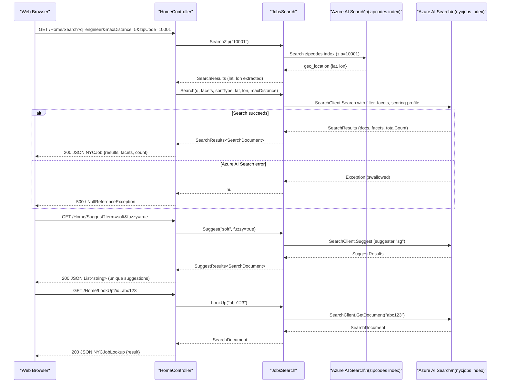

# API & Service Communication Contracts

The NYCJobsWeb solution exposes four MVC action endpoints on a single `HomeController` and relies on Azure AI Search as its sole backend service; there is no inter-service HTTP communication beyond direct SDK calls to the Azure AI Search REST API.

## Service Catalog

| Service | Port | Category | Purpose |
|---------|------|----------|---------|
| NYCJobsWeb | 80 / 443 (IIS / IIS Express) | API Layer | ASP.NET MVC 5 web application serving the job-search UI and JSON API actions |
| DataLoader | — (console, no port) | Infrastructure | One-shot console tool that provisions and bulk-loads the `nycjobs` and `zipcodes` Azure AI Search indexes |

## API Endpoints Inventory

| Service | Method | Path | Request Type | Response Type |
|---------|--------|------|-------------|--------------|
| NYCJobsWeb | GET | `/` → `Home/Index` | — | HTML (Razor view `Index.cshtml`) |
| NYCJobsWeb | GET | `/Home/JobDetails` | — | HTML (Razor view `JobDetails.cshtml`) |
| NYCJobsWeb | GET | `/Home/Search` | Query params: `q`, `businessTitleFacet`, `postingTypeFacet`, `salaryRangeFacet`, `sortType`, `lat`, `lon`, `currentPage`, `zipCode`, `maxDistance` | JSON — `NYCJob` (results, facets, count) |
| NYCJobsWeb | GET | `/Home/Suggest` | Query params: `term`, `fuzzy` (bool) | JSON — `List<string>` (unique suggestion strings) |
| NYCJobsWeb | GET | `/Home/LookUp` | Query param: `id` (string) | JSON — `NYCJobLookup` (single document) |

> Note: No API versioning scheme is implemented. All routes follow the default MVC convention `{controller}/{action}/{id}` registered in `RouteConfig.cs`.

## Management and Observability Endpoints

| Service | Endpoint | Notes |
|---------|----------|-------|
| NYCJobsWeb | None | No health-check, metrics, or Swagger endpoint is configured |
| DataLoader | None (console) | Prints progress to stdout only |

No Spring Boot Actuator, ASP.NET health checks (`/health`/`/healthz`), or Swagger/OpenAPI tooling is present. Custom metrics annotations (Micrometer, Application Insights) are not configured.

## DTOs and Contracts

Two response model classes are defined in `NYCJobsWeb.Models`:

| Class | API Role | Immutability | Notes |
|-------|----------|-------------|-------|
| `NYCJob` | Response body for `/Home/Search` | Mutable (plain class with properties) | Wraps `IList<SearchResult<SearchDocument>>`, facets dictionary, and total count |
| `NYCJobLookup` | Response body for `/Home/LookUp` | Mutable (plain class with property) | Wraps a single `SearchDocument` |

Both classes use `Azure.Search.Documents.Models.SearchDocument` (a dynamic `IDictionary<string, object>`) as their inner document type — no strongly-typed domain entity class is declared. Field-level schema is defined in the Azure AI Search index definition (JSON schema files under `NYCJobsWeb/Schema_and_Data/`), not in the C# model layer. See `data-architecture.md` for field-level details.

No OpenAPI/Swagger specification, `.proto` file, or GraphQL schema exists. Serialization is handled by ASP.NET MVC's built-in `JsonResult` using Newtonsoft.Json 10.0.3 with default settings (camelCase is not enforced; property names follow C# conventions).

## Communication Patterns

**Synchronous — SDK to Azure AI Search:**  
All data access is performed synchronously (blocking `.Result` or direct synchronous SDK calls) through `Azure.Search.Documents.SearchClient`. The `JobsSearch` class calls three operations: `Search<SearchDocument>` (full-text + faceted search), `Suggest<SearchDocument>` (autocomplete), and `GetDocument<SearchDocument>` (lookup by ID). A secondary `SearchClient` (`_indexZipClient`) queries the `zipcodes` index to resolve a zip code to geographic coordinates before the main search when `maxDistance > 0`. There is no async/await usage — all calls are fire-and-forget synchronous.

**Synchronous — Bing Geocoding:**  
`HomeController` imports `BingGeocoder` (BingGeocodingHelper 1.1) at the namespace level, and the `Search` action accepts `lat`/`lon` parameters from the client. The controller passes coordinates directly to `JobsSearch.Search()`; Bing geocoding is effectively delegated to the client-side JavaScript (`script.js`) which resolves the user's browser location or entered location before making the AJAX call.

**Asynchronous patterns:** None. There is no message queue, event bus, or pub/sub mechanism.

**Resilience patterns:** None. No circuit breaker (Polly, Resilience4j), retry policy, timeout configuration, or bulkhead is implemented. Failures in Azure AI Search SDK calls are caught with bare `try/catch` blocks that swallow exceptions, returning `null` to callers — there is no structured error response or fallback.

**Service discovery:** None. The Azure AI Search endpoint URL and API key are read from `Web.config` `<appSettings>` (`Searchendpoint`, `SearchServiceApiKey`) as hardcoded configuration values at startup. No service registry (Consul, Eureka, Azure Service Discovery) is used.

**API gateway:** None. The ASP.NET MVC application serves directly as the entry point with no gateway layer.

**Security posture:** No authentication or authorization is configured on any endpoint. `HomeController` has no `[Authorize]` attribute; there is no ASP.NET Identity, OAuth2, JWT validation, or OWIN/Katana security middleware. The Bing API key and Azure Search API key are stored as plaintext values in `Web.config`. All endpoints are publicly accessible with no authorization checks. Transport security (HTTPS/TLS) depends entirely on the IIS host configuration and is not enforced at the application level.

## Service Technology Matrix

| Service | Web Framework | Data Access | Discovery | Gateway | Health Checks | Cache | Metrics |
|---------|--------------|-------------|-----------|---------|--------------|-------|---------|
| NYCJobsWeb | ASP.NET MVC 5 | Azure.Search.Documents SDK 11.1.1 | None (hardcoded URL) | None | None | None | None |
| DataLoader | None (console) | Azure AI Search REST API (HttpClient) | None (hardcoded URL) | None | None | None | None |

## Service Communication Sequence

