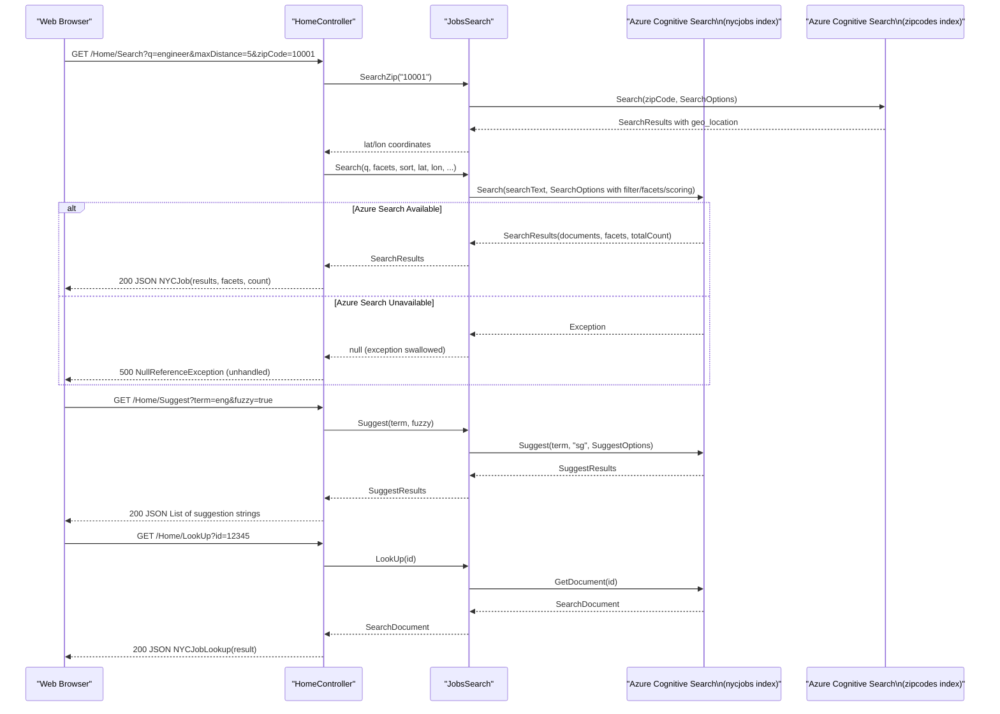

# API & Service Communication Contracts

The NYC Jobs Search solution exposes five HTTP endpoints through a single ASP.NET MVC 5 controller, all using synchronous request/response over HTTP with JSON responses — there is no API gateway, message broker, or inter-service communication.

## Service Catalog

| Service | Port | Category | Purpose |
|---------|------|----------|---------|
| NYCJobsWeb | 80/443 (IIS) | API Layer + UI | ASP.NET MVC 5 web application serving the job search UI and JSON API endpoints |
| DataLoader | N/A (console) | Infrastructure | One-time console utility for creating and populating Azure Cognitive Search indexes from local JSON files |
| Azure Cognitive Search (nycjobs) | 443 (external) | Infrastructure | Managed search service hosting the NYC job postings index |
| Azure Cognitive Search (zipcodes) | 443 (external) | Infrastructure | Managed search service hosting the zip code geo-coordinate index |

## API Endpoints Inventory

| Service | Method | Path | Request Type | Response Type |
|---------|--------|------|-------------|---------------|
| NYCJobsWeb | GET | `/` or `/Home/Index` | None | HTML (Razor View — Index.cshtml) |
| NYCJobsWeb | GET | `/Home/JobDetails` | None | HTML (Razor View — JobDetails.cshtml) |
| NYCJobsWeb | GET | `/Home/Search` | Query params: `q`, `businessTitleFacet`, `postingTypeFacet`, `salaryRangeFacet`, `sortType`, `lat`, `lon`, `currentPage`, `zipCode`, `maxDistance` | JSON — `NYCJob` (results, facets, count) |
| NYCJobsWeb | GET | `/Home/Suggest` | Query params: `term`, `fuzzy` | JSON — `List<string>` (unique suggestion strings) |
| NYCJobsWeb | GET | `/Home/LookUp` | Query param: `id` | JSON — `NYCJobLookup` (single job document) |

## Management & Observability Endpoints

| Service | Endpoint | Notes |
|---------|----------|-------|
| NYCJobsWeb | None | No health check, metrics, or Swagger/OpenAPI endpoints are configured |
| DataLoader | None | Console application; no HTTP endpoints |

No observability, metrics, or API documentation endpoints are exposed by any service in this solution.

## DTOs & Contracts

Two response model classes are defined in the `NYCJobsWeb.Models` namespace:

- **`NYCJob`** — response DTO for the `/Home/Search` endpoint. Aggregates Azure Search facets (`IDictionary<string, IList<FacetResult>>`), a list of search results (`IList<SearchResult<SearchDocument>>`), and a total count. This is a gateway-level aggregation model composed directly from the Azure.Search.Documents SDK types.
- **`NYCJobLookup`** — response DTO for the `/Home/LookUp` endpoint. Wraps a single `SearchDocument` (a schema-less dictionary from the Azure SDK). Not immutable.

Both DTOs are plain C# classes (not records) and are serialized to JSON by ASP.NET MVC's built-in `JsonResult` (using `JavaScriptSerializer` under the hood, not Newtonsoft.Json or System.Text.Json). Request parameters are bound from query strings — no request body DTOs are used. There is no OpenAPI/Swagger specification, no protobuf schema, and no GraphQL schema.

## Communication Patterns

**Synchronous REST only.** All client-to-server communication uses standard HTTP GET requests with query string parameters. The server communicates with Azure Cognitive Search using the `Azure.Search.Documents` 11.1.1 SDK, which internally issues authenticated HTTPS REST calls to the Azure Search REST API. No asynchronous messaging, message brokers, or event-driven patterns are used.

**No resilience patterns.** There is no circuit breaker, retry policy, timeout configuration, or bulkhead pattern implemented. If Azure Cognitive Search is unavailable, the `JobsSearch` methods catch exceptions, write to `Console.WriteLine`, and return `null` — the controller does not handle null responses, which would result in a `NullReferenceException` propagated to the client.

**No service discovery.** The Azure Search endpoint URL and API key are read from `Web.config` `<appSettings>` at application startup via `ConfigurationManager`. There is no dynamic service discovery or load balancing.

**No API gateway.** The web application serves both the HTML UI and JSON API endpoints directly. There is no reverse proxy, API gateway, or BFF pattern in place.

**Security posture.** No authentication or authorization is configured. All five endpoints are publicly accessible with no authorization checks, no JWT/OAuth2, and no role-based access control. The Azure Search API key is stored as plaintext in `Web.config`. HTTPS is available if configured at the IIS/hosting level, but no enforcement (HSTS, HTTPS redirect) is implemented in application code.

## Service Technology Matrix

| Service | Web Framework | Data Access | Discovery | Gateway | Health Checks | Cache | Metrics |
|---------|--------------|-------------|-----------|---------|--------------|-------|---------|
| NYCJobsWeb | ASP.NET MVC 5 | Azure.Search.Documents 11.1.1 (REST) | None — hardcoded URL | None | None | None | None |
| DataLoader | None (console) | Azure Search REST API (HttpClient) | None — hardcoded URL | None | None | None | None |

## Service Communication Sequence

