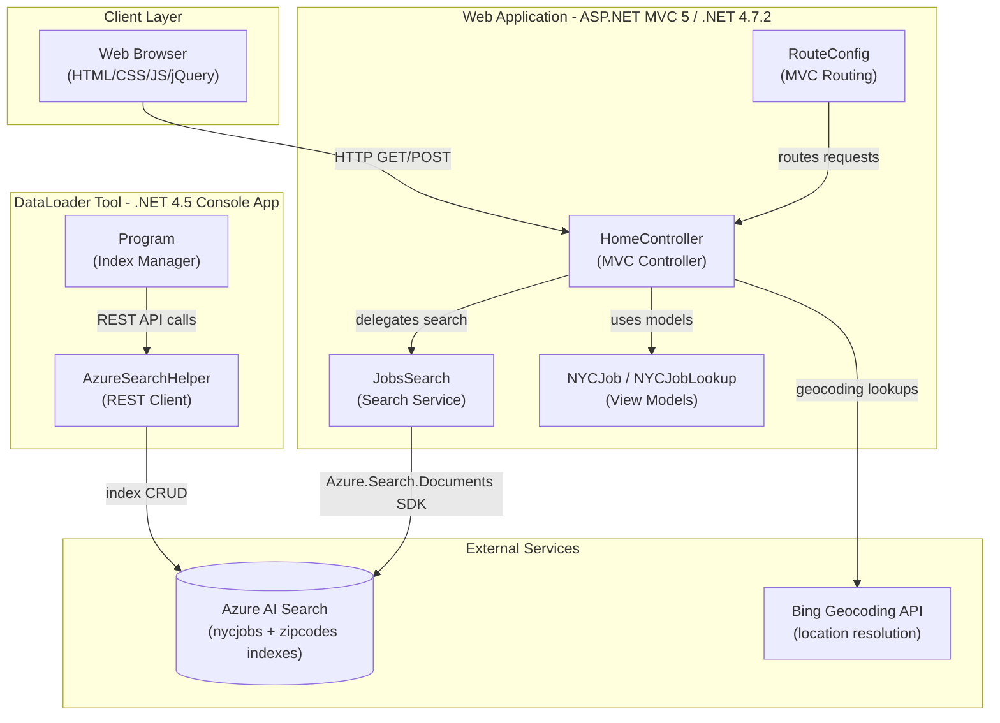
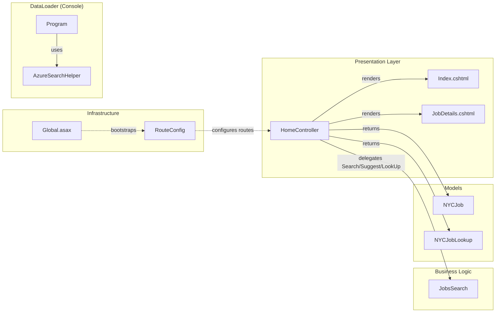

# Architecture Diagram

This document describes the architecture of the NYCJobsWeb application — a legacy ASP.NET MVC 5 web application backed by Azure AI Search, together with a companion DataLoader console utility for index management.

## Application Architecture

### Technology Stack Summary

| Layer | Technology | Version | Purpose |
|-------|-----------|---------|---------|
| Presentation | ASP.NET MVC | 5.2.2 | Server-side MVC web framework |
| Presentation | Razor Views | 3.2.2 | Server-side HTML templating |
| Presentation | jQuery | 3.1.1 | Client-side scripting and AJAX |
| Presentation | Bootstrap | 3.4.1 | Responsive UI framework |
| Business Logic | JobsSearch | — | Azure AI Search query orchestration |
| Data Access | Azure.Search.Documents SDK | 11.1.1 | Azure AI Search client library |
| External Integration | BingGeocodingHelper | 1.1 | Geocoding / zip-code to lat-lon resolution |
| External Integration | Microsoft.Spatial | 7.5.3 | Geo-point types for distance filtering |
| Serialization | Newtonsoft.Json | 10.0.3 | JSON serialization (web app) |
| Serialization | Newtonsoft.Json | 9.0.1 | JSON serialization (DataLoader) |
| Runtime | .NET Framework | 4.7.2 | Web application target framework |
| Runtime | .NET Framework | 4.5 | DataLoader target framework |

### Data Storage and External Services

The application does not own or host its own database. All persistent data resides in **Azure AI Search**, which serves two indexes: `nycjobs` (NYC government job postings with fields such as agency, business title, salary range, geo-location, and job description) and `zipcodes` (zip-code-to-latitude/longitude lookup data). The `DataLoader` console tool is responsible for provisioning these indexes by calling the Azure AI Search REST API (API version `2015-02-28-Preview`) to delete, recreate, and bulk-import documents from JSON files bundled under `NYCJobsWeb/Schema_and_Data/`. The web application queries the indexes at runtime using the `Azure.Search.Documents` SDK. **Bing Geocoding API** is called at request time to resolve a user-supplied zip code into geographic coordinates used for geo-distance filtering.

### Key Architectural Decisions

- **Azure AI Search as the sole data store**: All search, faceting, pagination, scoring, and geo-distance filtering are delegated entirely to Azure AI Search via the SDK — there is no local relational database.
- **Static singleton search client**: `JobsSearch` initializes `SearchClient` instances as static fields on class load, reusing a single HTTP connection pool for all requests, which is the recommended pattern for `Azure.Search.Documents`.
- **Faceted navigation and scoring profiles**: The search layer uses configurable facets (`business_title`, `posting_type`, `salary_range_from`) and a named scoring profile (`jobsScoringFeatured`) to support relevance-tuned "featured" results alongside standard sort orders.

## Component Relationships

### Component Inventory

| Component | Layer | Type | Responsibility |
|-----------|-------|------|----------------|
| HomeController | Presentation | MVC Controller | Handles all HTTP routes: Index page, job details, search queries, autocomplete suggestions, and document lookup |
| Index.cshtml | Presentation | Razor View | Main search UI — search bar, facet panel, results list, pagination |
| JobDetails.cshtml | Presentation | Razor View | Individual job posting detail page |
| JobsSearch | Business Logic | Service Class | Wraps Azure AI Search SDK calls for full-text search, zip-code lookup, autocomplete suggestions, and direct document lookup |
| NYCJob | Models | View Model | Carries search response data (results list, facets, total count) from controller to JSON response |
| NYCJobLookup | Models | View Model | Carries single-document lookup result from controller to JSON response |
| RouteConfig | Infrastructure | Route Configuration | Registers MVC default route `{controller}/{action}/{id}` |
| Global.asax | Infrastructure | Application Startup | Bootstraps MVC areas, filters, routes, and bundles on application start |
| Program (DataLoader) | DataLoader | Console Entry Point | Orchestrates index teardown, creation, and bulk document import for `nycjobs` and `zipcodes` indexes |
| AzureSearchHelper | DataLoader | HTTP Helper | Wraps raw `HttpClient` calls to the Azure AI Search REST API with JSON serialization and API-version query-string injection |
