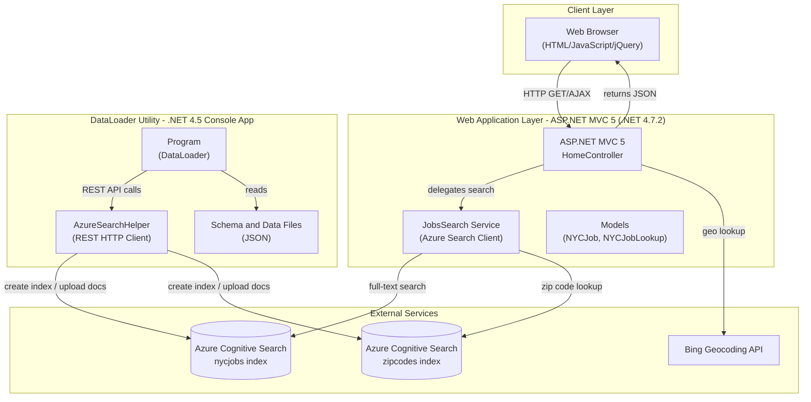
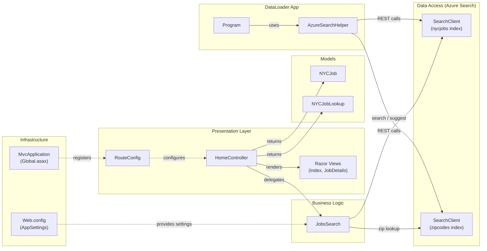

# Architecture Diagram

This document describes the architecture of the NYC Jobs Search application, which consists of an ASP.NET MVC 5 web front-end backed by Azure Cognitive Search, and a .NET console-based DataLoader utility for seeding search indexes.

## Application Architecture

### Technology Stack Summary

| Layer | Technology | Version | Purpose |
|-------|-----------|---------|---------|
| Presentation | ASP.NET MVC 5 | 5.x | Server-side web framework, controller routing |
| Presentation | HTML/JavaScript/jQuery | - | Browser-side search UI |
| Search Client | Azure.Search.Documents | 11.1.1 | Azure Cognitive Search SDK for .NET |
| Geolocation | BingGeocodingHelper | 1.1 | Bing Maps geo-coordinate lookup |
| Spatial | Microsoft.Spatial | 7.5.3 | Geo-point types for distance-based filtering |
| Serialization | Newtonsoft.Json | 10.0.3 | JSON serialization in DataLoader |
| Target Framework (Web) | .NET Framework | 4.7.2 | Web application runtime |
| Target Framework (DataLoader) | .NET Framework | 4.5 | Console utility runtime |

### Data Storage & External Services

The application relies entirely on **Azure Cognitive Search** for all data persistence and retrieval. Two indexes are used: `nycjobs` (NYC job postings with facets, scoring profiles, geo-location, and full-text search) and `zipcodes` (postal code to geo-coordinate mapping for distance-based filtering). There is no relational database; all data is loaded into search indexes by the `DataLoader` console utility from local JSON files. **Bing Geocoding API** is used for resolving zip codes to latitude/longitude coordinates when users filter jobs by proximity.

### Key Architectural Decisions

- **Azure Cognitive Search as primary data store**: All job data is stored and queried via Azure Cognitive Search rather than a traditional relational database, enabling faceted navigation, geo-distance filtering, fuzzy suggestions, and relevance scoring out of the box.
- **Static index loading via DataLoader**: A separate console application handles one-time or batch index creation and data upload via direct REST API calls, decoupling data seeding from the web application.
- **Lightweight MVC with AJAX**: The web layer is a single-controller MVC 5 app that exposes JSON endpoints (`/Search`, `/Suggest`, `/LookUp`) consumed by client-side JavaScript, resulting in a thin server layer with a rich browser UI.

## Component Relationships

### Component Inventory

| Component | Layer | Type | Responsibility |
|-----------|-------|------|----------------|
| HomeController | Presentation | MVC Controller | Handles Index, Search, Suggest, and LookUp HTTP endpoints; returns JSON responses |
| Views/Home/Index | Presentation | Razor View | Main search UI page |
| Views/Home/JobDetails | Presentation | Razor View | Job detail display page |
| RouteConfig | Infrastructure | Route Configuration | Registers MVC default route |
| MvcApplication | Infrastructure | HTTP Application | Application startup, area and route registration |
| JobsSearch | Business Logic | Service Class | Encapsulates Azure Cognitive Search operations: full-text search, zip lookup, suggest, and document lookup |
| NYCJob | Models | Model Class | Aggregates facets, search results, and total count for response |
| NYCJobLookup | Models | Model Class | Wraps a single SearchDocument result for detail lookup |
| SearchClient (nycjobs) | Data Access | Azure Search Client | Executes queries against the nycjobs index |
| SearchClient (zipcodes) | Data Access | Azure Search Client | Executes queries against the zipcodes index |
| Program (DataLoader) | DataLoader | Console Entry Point | Orchestrates index deletion, creation, and data import |
| AzureSearchHelper | DataLoader | HTTP Helper | Sends authenticated REST requests to Azure Search REST API |
