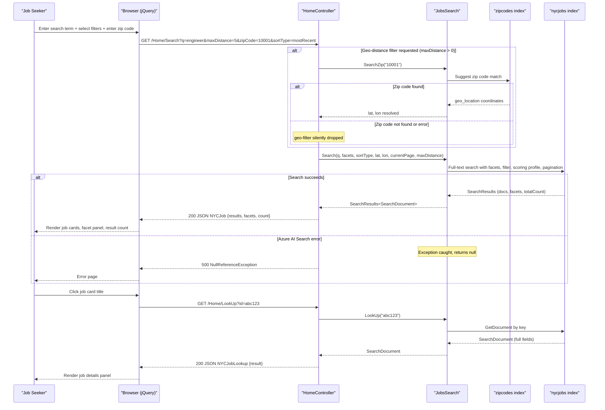

# Core Business Workflows

The NYCJobsWeb application enables job seekers to search, filter, and explore New York City government job postings using full-text search, faceted navigation, geographic distance filtering, and autocomplete suggestions.

## Domain Entities

| Entity | Service / Bounded Context | Description | Key Relationships |
|--------|--------------------------|-------------|------------------|
| NycJob | Job Search (NYCJobsWeb) | A NYC government job posting with salary, location, agency, description, and geographic coordinates | Standalone — no relational foreign keys; tags field is a multi-value collection |
| ZipCode | Location Resolution (NYCJobsWeb) | A US zip code mapped to geographic coordinates (latitude/longitude) | Used as a lookup to resolve a user-entered zip code into a geo-point for NycJob distance filtering |
| NYCJob (ViewModel) | API Response (NYCJobsWeb) | Aggregated search response combining a list of job results, facet counts, and total result count | Wraps a list of NycJob search results returned from Azure AI Search |
| NYCJobLookup (ViewModel) | API Response (NYCJobsWeb) | Single job posting detail retrieved by document key | Wraps one NycJob document for the job details page |

## Service-to-Domain Mapping

| Service | Domain Context | Owned Entities | External Dependencies |
|---------|---------------|---------------|----------------------|
| NYCJobsWeb | Job Search & Discovery | NycJob (read), ZipCode (read), NYCJob ViewModel, NYCJobLookup ViewModel | Azure AI Search (nycjobs and zipcodes indexes), Bing Geocoding API |
| DataLoader | Index Provisioning | NycJob (write), ZipCode (write) | Azure AI Search REST API |

Both services operate in the same domain but with fully separated responsibilities: DataLoader is the sole writer (source of truth at provision time) and NYCJobsWeb is the sole reader at runtime. There is no event-driven communication, shared database, or REST API call between the two — they are decoupled by the Azure AI Search indexes they both access.

## Primary Workflows

### Workflow 1: Faceted Job Search with Optional Geo-Distance Filtering

The primary user workflow. A job seeker submits a search query from the browser. The application resolves an optional zip-code-based geographic filter, executes a full-text search against Azure AI Search with faceting and pagination, and returns a JSON result set for the UI to render.

**Steps:**
1. User enters a search term (or leaves it blank for "all jobs") and optionally selects facets (business title, posting type, salary range) and a sort order (featured, most recent, salary ascending/descending).
2. Browser sends a GET request to `/Home/Search` with the query string parameters.
3. If `maxDistance > 0` (geo-distance filter requested), `HomeController` calls `JobsSearch.SearchZip(zipCode)` to look up the geographic center point for the entered zip code.
4. The resolved lat/lon are injected as an OData `geo.distance()` filter into the main search call.
5. `HomeController` calls `JobsSearch.Search(...)` which constructs `SearchOptions` with:
   - Field selection (id, agency, posting_type, salary fields, work_location, job_description, posting_date, geo_location, tags)
   - Facet declarations (business_title, posting_type, level, salary_range_from with interval 50000)
   - Highlight configuration (job_description field, `<b>` tags)
   - Active sort order or scoring profile
   - Active OData filter expression (combining facet selections and geo-distance if applicable)
   - Pagination (page size 10, skip = currentPage - 1)
6. Azure AI Search returns a `SearchResults<SearchDocument>` with matching documents, facet counts, and total count.
7. `HomeController` wraps the result in an `NYCJob` view model and returns it as JSON.
8. The browser UI renders the results list, updates facet counts, and reflects the total count.

---

### Workflow 2: Job Posting Detail Lookup

A job seeker clicks on a search result to view full details of a specific posting.

**Steps:**
1. Browser sends GET `/Home/LookUp?id={documentKey}` where `id` is the Azure AI Search document key extracted from a previous search result.
2. `HomeController.LookUp(id)` calls `JobsSearch.LookUp(id)`.
3. `JobsSearch.LookUp` calls `SearchClient.GetDocument<SearchDocument>(id)` — a direct key-based document fetch (no full-text query).
4. The `SearchDocument` is wrapped in `NYCJobLookup` and returned as JSON.
5. The `JobDetails.cshtml` view uses JavaScript to render the full posting details.

---

### Workflow 3: Type-Ahead Autocomplete Suggestions

As the user types in the search box, the browser requests autocomplete suggestions.

**Steps:**
1. Browser sends GET `/Home/Suggest?term={partialText}&fuzzy={true|false}`.
2. `HomeController.Suggest` calls `JobsSearch.Suggest(term, fuzzy)`.
3. `JobsSearch.Suggest` calls `SearchClient.Suggest<SearchDocument>(term, "sg", SuggestOptions)` using the `sg` suggester, which covers agency, posting_type, business_title, civil_service_title, work_location, and division_work_unit fields.
4. The results list is deduplicated (`Distinct()`) and returned as a JSON array of strings.
5. The browser jQuery UI autocomplete widget renders the suggestions inline.

---

### Workflow 4: Index Provisioning (DataLoader)

An operator runs the DataLoader console tool to set up or reset the Azure AI Search indexes with fresh data.

**Steps:**
1. Operator configures `app.config` with the target Azure AI Search service name and Admin API key.
2. `Program.Main` runs `LaunchImportProcess` for both `zipcodes` and `nycjobs` indexes in sequence.
3. For each index: the existing index is deleted via REST DELETE, the schema JSON file is read and posted via REST PUT to create the index, then all matching `{indexName}*.json` data files are iterated and uploaded in batches via REST POST.
4. Index creation uses the schema definition in `NYCJobsWeb/Schema_and_Data/{indexName}.schema`, which includes field definitions, the `jobsScoringFeatured` scoring profile, the `sg` suggester, and CORS settings.

## Cross-Service Data Flows

The application has a two-step sequential lookup pattern — not a microservice gateway aggregation in the traditional sense — but the `HomeController.Search` action performs an intra-request cross-index composition:

1. **Zip → Geo-point resolution**: When geo-distance filtering is requested, the controller first queries the `zipcodes` index synchronously to retrieve the geographic center point of the entered zip code. This is a blocking lookup before the main search.
2. **Main job search with injected geo-filter**: The resolved coordinates are incorporated as an OData filter in the primary `nycjobs` search call.

**Fallback behavior**: If the `SearchZip` call fails (exception caught and swallowed), `maxDistanceLat` and `maxDistanceLon` remain empty strings — the geo-filter is silently dropped and the search proceeds without distance filtering. The user receives results without any indication that the geo-filter was not applied. Similarly, if the main search fails, `null` is returned, which will cause a `NullReferenceException` in the controller when attempting to call `.GetResults()` on a null response — producing an unhandled HTTP 500 error with no user-friendly message.

## Business Workflow Sequence

## Business Rules and Decision Logic

### Search Query Construction Rules

- **Blank query → match-all**: If the search term is empty or whitespace, it is replaced with `"*"` before being sent to Azure AI Search, returning all documents subject to active filters.
- **Default location**: If no lat/lon is supplied by the client, a default center point of `lat=40.736224, lon=-73.99251` (Manhattan, NYC) is used.
- **Default zip code**: If no zip code is supplied, `10001` (Chelsea, Manhattan) is the default.
- **Facet filter construction**: Active facet selections (business title, posting type, salary range) are combined with OData `and` into a single filter string. Salary range facets are expressed as range filters: `salary_range_from ge {value} and salary_range_from lt {value + 50000}`.
- **Geo-distance filter**: Applied only when `maxDistance > 0`. The filter uses the OData `geo.distance()` function against the `geo_location` field of `nycjobs` documents and the coordinates resolved from `zipcodes`.

### Sort and Scoring Rules

- **featured**: Uses the `jobsScoringFeatured` scoring profile, which boosts `business_title` and `civil_service_title` text matches (weight 3.0), boosts documents tagged with the `featuredParam` tag (boost 10.0), boosts documents with `posting_date` within the last 500 days (freshness boost 3.0), and boosts documents geographically close to the map center within 5km (distance boost 6.0).
- **salaryDesc / salaryIncr**: Sorts by `salary_range_from` descending or ascending.
- **mostRecent**: Sorts by `posting_date` descending.
- **Default (no sort)**: Azure AI Search default relevance ranking.

### Autocomplete Rules

- Fuzzy matching is optional (controlled by the `fuzzy` boolean parameter).
- Suggester `sg` covers six fields: agency, posting_type, business_title, civil_service_title, work_location, division_work_unit.
- Returns up to 8 suggestions, deduplicated.

### Error Handling (Business Impact)

- All `JobsSearch` methods use bare `try/catch` blocks that swallow exceptions and return `null` — there is no structured error response, retry, or user notification.
- When `SearchZip` returns `null`, the geo-distance filter is silently omitted with no user notification.
- When `Search` returns `null`, the controller dereferences the null result, producing an unhandled HTTP 500 with no user-friendly error message.
- There are no business exception types, compensating actions, or dead-letter handling.

### Authorization Rules

- None. All workflows are publicly accessible without authentication or role checks.

### Audit and Logging

- None. No business event logging, audit trail, or structured logging is implemented. Errors are written to `Console.WriteLine` in the `JobsSearch` class (unreachable in an IIS-hosted process).
