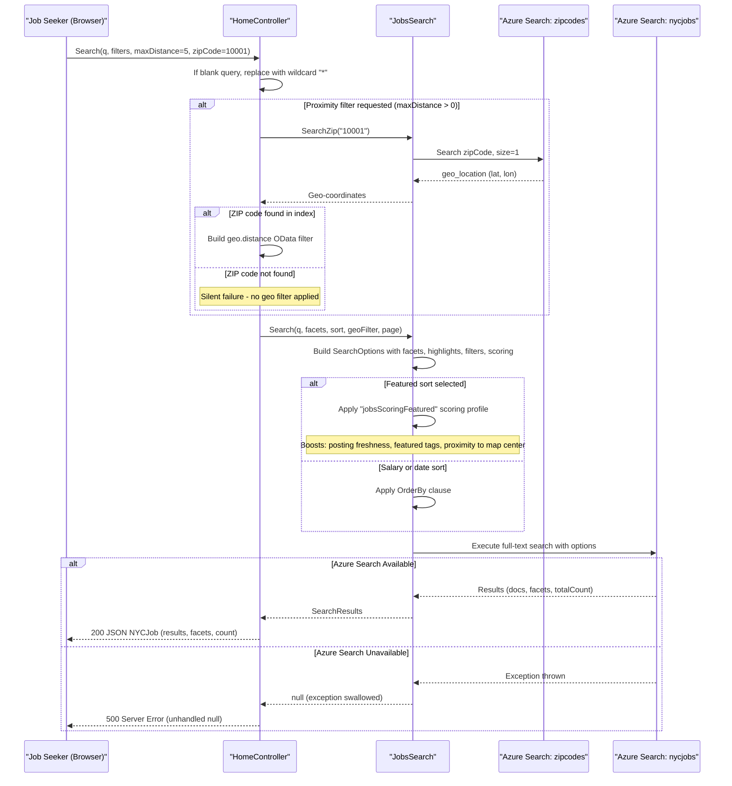

# Core Business Workflows

The NYC Jobs Search application enables job seekers to search, filter, and explore NYC government job postings using full-text search, faceted navigation, geographic proximity filtering, and autocomplete suggestions.

## Domain Entities

| Entity | Service / Bounded Context | Description | Key Relationships |
|--------|--------------------------|-------------|------------------|
| Job Posting (nycjobs index) | NYCJobsWeb — Job Search | Represents an open NYC government job listing with title, agency, salary, location, description, and posting dates | References ZipCode via geo-coordinates for proximity filtering |
| ZipCode (zipcodes index) | NYCJobsWeb — Geographic Reference | Maps a US ZIP code to a geographic point (latitude/longitude) and municipality metadata | Looked up by ZIP code; result geo-coordinates used as a filter parameter in Job Posting queries |
| Search Results Aggregate | NYCJobsWeb — Query Response | A transient aggregation of job posting results, facet counts, and total result count returned to the browser | Composed from Job Postings; not persisted |

## Service-to-Domain Mapping

| Service | Domain Context | Owned Entities / Indexes | External Dependencies |
|---------|---------------|-------------------------|----------------------|
| NYCJobsWeb | Job Search & Discovery | Job Posting (read-only), ZipCode (read-only), Search Results Aggregate | Azure Cognitive Search (nycjobs, zipcodes), Bing Geocoding API |
| DataLoader | Index Management | Job Posting (write), ZipCode (write) | Azure Cognitive Search REST API |

## Primary Workflows

### Workflow 1: Full-Text Job Search with Faceted Filtering

A user enters a search query and optionally selects facet filters (business title, posting type, salary range) and a sort order. The application retrieves matching job postings from Azure Cognitive Search with facet counts, highlighting, and pagination.

**Steps:**
1. User submits a search query string (or blank, which defaults to `"*"` — return all) via browser AJAX to `GET /Home/Search`.
2. Optional facet parameters are applied as OData filters: `business_title`, `posting_type`, `salary_range_from` (range bucket).
3. Sort order maps to a scoring profile or `OrderBy` clause: featured (scoring profile + map center boost), salary descending, salary ascending, most recent.
4. If proximity filtering is active (see Workflow 2), a `geo.distance` filter is added.
5. Azure Cognitive Search executes the query with search highlighting on `job_description` (wraps matches in `<b>` tags).
6. Results are returned as a `NYCJob` aggregate: up to 10 documents per page, facet counts, and total result count.
7. Browser renders the results and facet navigation panel.

**Business rules involved:** blank query promotion, facet filter composition, scoring profile selection (see Business Rules section).

---

### Workflow 2: Proximity-Based Job Search

A user enables distance filtering by specifying a ZIP code and a maximum distance in miles. The application resolves the ZIP code to geo-coordinates and filters job postings by proximity.

**Steps:**
1. User provides `zipCode` (integer) and `maxDistance` (integer, miles > 0) in addition to the standard search parameters.
2. `HomeController.Search` calls `JobsSearch.SearchZip(zipCode.ToString())` to look up the ZIP code in the `zipcodes` index.
3. The first result's `geo_location.Latitude` and `geo_location.Longitude` are extracted and converted to invariant-culture strings.
4. A `geo.distance(geo_location, geography'POINT(lon lat)') le {maxDistance}` OData filter is appended to the nycjobs query.
5. The search executes with both the text query and the geo-distance constraint active simultaneously.

**Failure mode:** If `maxDistance > 0` but the ZIP code lookup returns no results, `maxDistanceLat` and `maxDistanceLon` remain empty strings, and the geo-distance filter is malformed or omitted — no error is surfaced to the user.

---

### Workflow 3: Autocomplete / Type-Ahead Suggestion

As the user types a search term, the browser requests suggestions to populate a dropdown.

**Steps:**
1. Browser sends `GET /Home/Suggest?term={partial}&fuzzy=true` on keystroke.
2. `JobsSearch.Suggest` calls the `sg` suggester on the nycjobs index — a pre-configured infix-matching suggester over fields: `agency`, `posting_type`, `business_title`, `civil_service_title`, `work_location`, `division_work_unit`.
3. Up to 8 suggestions are returned; duplicate strings are removed (`Distinct()`).
4. Browser renders the deduplicated suggestion list as a dropdown.

---

### Workflow 4: Job Detail Lookup

A user clicks a job posting to view full details.

**Steps:**
1. Browser sends `GET /Home/LookUp?id={documentKey}`.
2. `JobsSearch.LookUp` issues a point-lookup (`GetDocument`) against the nycjobs index by document key (`id` field).
3. The full `SearchDocument` (all indexed fields) is returned as `NYCJobLookup.Result`.
4. Browser renders the detail view using the `JobDetails.cshtml` page, which reads fields from the JSON response via JavaScript.

---

### Workflow 5: Index Seeding (DataLoader)

An operator runs the DataLoader console application to populate Azure Cognitive Search indexes from local JSON data files.

**Steps:**
1. Operator runs `DataLoader.exe` with `TargetSearchServiceName` and `TargetSearchServiceApiKey` configured in `app.config`.
2. For each of `zipcodes` and `nycjobs` in sequence:
   a. Delete the existing index via `DELETE /indexes/{name}`.
   b. Create the index from the corresponding `*.schema` JSON file via `POST /indexes`.
   c. Bulk-upload all documents from matching `{name}*.json` files via `POST /indexes/{name}/docs/index`.
3. After all uploads complete, the operator is prompted to press any key.

**Constraint:** DataLoader uses the legacy Azure Search REST API version `2015-02-28-Preview`, which is significantly older than the SDK version used by the web app.

## Cross-Service Data Flows

This application has no microservice inter-service communication; both components interact independently with Azure Cognitive Search. The only cross-entity data flow is the **two-query geo-aggregation** in Workflow 2:

1. **NYCJobsWeb** queries the `zipcodes` index with the user-provided ZIP code string.
2. It extracts the `geo_location` field from the first result.
3. It injects those coordinates as an OData geo-distance filter into the subsequent `nycjobs` query.

This is an **application-layer join** — there is no server-side cross-index query in Azure Cognitive Search. The `zipcodes` index acts as a reference data lookup table. If the ZIP code is not found in the index, the proximity filter is silently skipped (no fallback error message or default radius).

## Business Workflow Sequence

## Business Rules & Decision Logic

### Validation Rules

- **Blank query promotion**: If `q` is null or whitespace, it is replaced with `"*"` before querying, ensuring a blank search returns all results rather than an empty set.
- **ZIP code as string**: `zipCode` (integer) is converted to a string before passing to `SearchZip`. No validation is performed on whether the integer is a valid 5-digit US ZIP code.
- **No server-side input sanitization**: Facet filter values (`businessTitleFacet`, `postingTypeFacet`) are interpolated directly into OData filter strings using string concatenation (e.g., `"business_title eq '" + businessTitleFacet + "'"`), creating a potential OData injection risk if malicious values are passed.

### Decision Logic

| Decision Point | Logic | Business Outcome |
|---------------|-------|-----------------|
| Sort type | `sortType` parameter mapped to `"featured"`, `"salaryDesc"`, `"salaryIncr"`, `"mostRecent"`, or default (relevance) | Controls result ordering and scoring profile activation |
| Proximity filter activation | `maxDistance > 0` | Triggers ZIP-to-geo lookup and appends geo.distance filter |
| Featured scoring | `sortType == "featured"` | Activates `jobsScoringFeatured` profile: boosts recent postings (P500D freshness), featured-tagged jobs (10x), and proximity to map center (6x within 5km) |
| Fuzzy suggestions | `fuzzy=true` (default) | Azure Search uses fuzzy matching on suggester fields; returns broader but less precise suggestions |

### State Transitions

There are no mutable entity state transitions in the web application. Job postings are read-only from the web layer. DataLoader performs destructive index replacement (delete → recreate → reload) with no incremental update or versioning.

### Error Handling

- All `JobsSearch` methods wrap Azure Search SDK calls in `try/catch(Exception)` and write to `Console.WriteLine` on failure, returning `null`.
- `HomeController` does not check for null return values from `JobsSearch`, meaning any Azure Search exception will propagate as a `NullReferenceException` to the client as an HTTP 500.
- No compensating actions, retry logic, dead-letter handling, or user-facing error messages are implemented.

### Authorization

No authentication, authorization, or role-based access control is applied to any endpoint. All search, suggest, and lookup operations are publicly accessible without any identity check.
