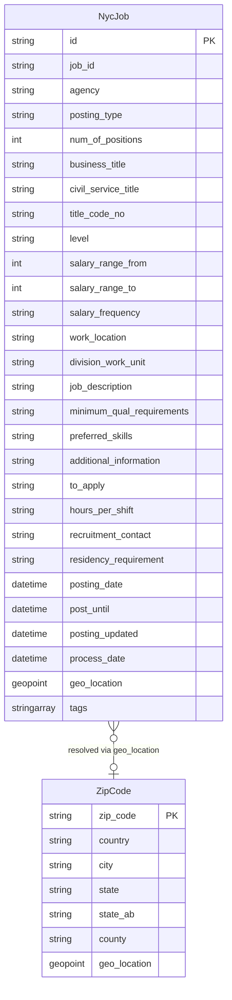

# Data Architecture & Persistence Layer

The application stores all data in two Azure AI Search indexes (`nycjobs` and `zipcodes`) — there is no relational database, ORM, or local persistence layer. Data access is performed exclusively through the `Azure.Search.Documents` SDK against the hosted Azure AI Search service.

## Database Configuration

| Service / Module | DB Type | Profile | Driver / SDK | Connection | Migration Tool |
|-----------------|---------|---------|-------------|-----------|---------------|
| NYCJobsWeb | Azure AI Search | All (single config) | Azure.Search.Documents 11.1.1 | Endpoint + API key from `Web.config` `<appSettings>` | Manual — DataLoader console tool |
| DataLoader | Azure AI Search | All (single config) | Raw HttpClient, REST API v`2015-02-28-Preview` | Endpoint + API key from `app.config` `<appSettings>` | Manual — Program.cs orchestrates index teardown and re-creation |

Schema management is entirely manual: the DataLoader tool reads `.schema` JSON files from `NYCJobsWeb/Schema_and_Data/` and posts them to the Azure AI Search REST API to (re-)create the indexes. There is no migration versioning, diff-based schema evolution tool (Flyway, Liquibase, EF Migrations), or rollback mechanism. Seed data is loaded from chunked JSON files (`nycjobs1.json` … `nycjobs6.json`, `zipcodes*.json`) by the same DataLoader tool. See `configuration-inventory.md` for the full list of configuration properties.

## Data Ownership per Service

| Service | Index / Entity Owned | Data Access Layer | Caching | Notes |
|---------|---------------------|------------------|---------|-------|
| NYCJobsWeb | `nycjobs` (read), `zipcodes` (read) | Azure.Search.Documents SDK | None | Read-only at runtime; no writes from the web application |
| DataLoader | `nycjobs` (write), `zipcodes` (write) | Azure AI Search REST API (HttpClient) | None | Write-only at provision time; deletes and recreates indexes on each run |

## Entity Model

> Note: Azure AI Search indexes are not relational entities — there are no foreign keys or joins between indexes. The ER diagram below represents the logical field structure of each index, with a conceptual link showing how `zipcodes` is used to resolve geographic coordinates for `nycjobs` geo-distance filtering.

## Key Repository Methods

There is no repository interface layer in the traditional sense (no `IRepository<T>`, `JpaRepository`, or `DbContext`). All data access is encapsulated in the `JobsSearch` class (`NYCJobsWeb/JobsSearch.cs`).

| Service | Class | Method | Purpose |
|---------|-------|--------|---------|
| NYCJobsWeb | `JobsSearch` | `Search(searchText, businessTitleFacet, postingTypeFacet, salaryRangeFacet, sortType, lat, lon, currentPage, maxDistance, maxDistanceLat, maxDistanceLon)` | Full-text search with faceting, pagination, sorting, geo-distance filter, and scoring profile support against `nycjobs` index |
| NYCJobsWeb | `JobsSearch` | `SearchZip(zipCode)` | Queries `zipcodes` index to resolve a zip code string to a geo-point — used to populate `maxDistanceLat`/`maxDistanceLon` before the main search |
| NYCJobsWeb | `JobsSearch` | `Suggest(searchText, fuzzy)` | Calls `SearchClient.Suggest` using the `sg` suggester with optional fuzzy matching for type-ahead autocomplete |
| NYCJobsWeb | `JobsSearch` | `LookUp(id)` | Retrieves a single document by document key (`id` field) via `SearchClient.GetDocument` |
| DataLoader | `Program` | `LaunchImportProcess(indexName)` | Orchestrates `DeleteIndex` → `CreateTargetIndex` → `ImportFromJSON` for a named index |
| DataLoader | `Program` | `ImportFromJSON(indexName)` | Iterates over all matching `{indexName}*.json` files in `Schema_and_Data/` and batch-posts them to the index |

## Caching Strategy

No caching layer is implemented. Neither the web application nor the DataLoader tool uses any in-memory cache (MemoryCache, IDistributedCache), distributed cache (Redis, NCache), or query result caching. Each HTTP request to `/Home/Search`, `/Home/Suggest`, or `/Home/LookUp` results in a live call to Azure AI Search.

There is no `@Cacheable`, Spring Cache, ASP.NET `ResponseCache`, or output caching directive on any controller action or service method.

**Observation:** Because the `zipcodes` index is a static reference dataset (zip codes do not change frequently), the `SearchZip` call on every geo-distance search request is an obvious candidate for an in-memory cache with a long TTL (hours to days).

## Data Ownership Boundaries

Both indexes are hosted in a single shared Azure AI Search service instance (`azs-playground.search.windows.net` in the default configuration). There is no database-per-service isolation. The two services (NYCJobsWeb and DataLoader) access the same indexes but with complementary access patterns:

- **NYCJobsWeb** is purely read-only at runtime, using the SDK with a Query API key.
- **DataLoader** is write-only at provision time, using a full Admin API key over raw REST.

There are no cross-index joins inside Azure AI Search. The `zipcodes` → `nycjobs` relationship is resolved at the application layer in `HomeController.Search()`: the zip code is first resolved to coordinates via `SearchZip`, and those coordinates are then injected as an OData `geo.distance()` filter into the main search call. This is effectively a client-side lookup join.

**No CQRS or event sourcing** patterns are present. The data flow is simple: DataLoader writes, NYCJobsWeb reads.

### Data Classification and Sensitivity

| Index / Entity | Sensitive Fields | Classification | Controls in Place |
|---------------|-----------------|---------------|------------------|
| `nycjobs` | `recruitment_contact` (may contain recruiter name and contact details) | Potentially PII | None — field is stored as plain text with no masking or access control |
| `nycjobs` | `job_description`, `minimum_qual_requirements`, `preferred_skills`, `additional_information` | Public (government job postings) | Not applicable — data is publicly sourced |
| `zipcodes` | None — geographic reference data only | Public | Not applicable |

The `nycjobs` dataset consists of publicly available NYC government job postings, so the bulk of the data carries no confidentiality requirement. The `recruitment_contact` field may contain individual staff contact information (name, phone, email) that constitutes PII under GDPR/CCPA. No encryption-at-rest configuration, field-level masking, or access-control restrictions are applied to this field. The Azure AI Search service's CORS configuration in the schema (`allowedOrigins: ["*"]`) permits cross-origin reads from any domain with no authentication, which means `recruitment_contact` values are publicly retrievable via the search API.
