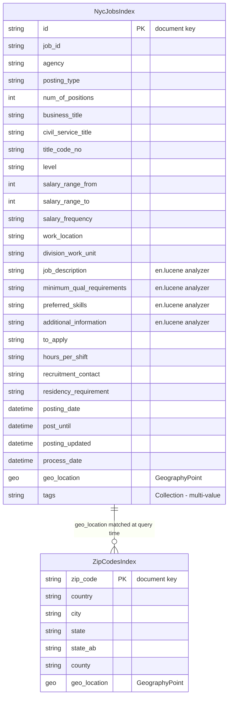

# Data Architecture & Persistence Layer

This solution uses **Azure Cognitive Search** exclusively as its data store — there is no relational database, ORM, or migration tool. All data is modeled as two search indexes (`nycjobs` and `zipcodes`) and accessed via the Azure.Search.Documents SDK.

## Database Configuration

| Service/Module | DB Type | Profile | Driver | Connection | Migration Tool |
|----------------|---------|---------|--------|-----------|----------------|
| NYCJobsWeb | Azure Cognitive Search | All (single environment) | Azure.Search.Documents 11.1.1 | Endpoint URL + API key from `Web.config` appSettings | None — schema managed via JSON schema files |
| DataLoader | Azure Cognitive Search REST API | All (single environment) | System.Net.Http (direct REST) | Service name + API key from `app.config` appSettings | None — DataLoader re-creates indexes from `*.schema` files each run |

Schema definitions for both indexes are maintained as raw JSON files in `NYCJobsWeb/Schema_and_Data/` (`nycjobs.schema`, `zipcodes.schema`). The `DataLoader` utility deletes and recreates indexes on every run, then bulk-uploads documents from the accompanying JSON data files. There is no versioned migration history or incremental schema evolution mechanism.

## Data Ownership per Service

| Service | Indexes Owned | Data Access Framework | Caching | Notes |
|---------|--------------|----------------------|---------|-------|
| NYCJobsWeb | `nycjobs` (read), `zipcodes` (read) | Azure.Search.Documents 11.1.1 SDK | None | Read-only; no writes to Azure Search from the web app |
| DataLoader | `nycjobs` (write), `zipcodes` (write) | Azure Search REST API (HttpClient) | None | Write-only utility; deletes and re-creates indexes from local JSON files |

## Entity Model

> Note: This application has no ORM entities. The "entities" below represent Azure Cognitive Search index schemas defined in `NYCJobsWeb/Schema_and_Data/*.schema`. Documents are returned as schema-less `SearchDocument` (dictionary) objects at runtime.

## Key Repository Methods

| Service | Repository / Client | Notable Methods | Purpose |
|---------|-------------------|----------------|---------|
| NYCJobsWeb | `JobsSearch` (custom service class) | `Search(searchText, facets, sort, lat, lon, page, maxDistance, ...)` | Full-text search with faceted navigation, geo-distance filter, scoring profiles, and pagination |
| NYCJobsWeb | `JobsSearch` | `SearchZip(zipCode)` | Looks up geo-coordinates (lat/lon) for a zip code to enable distance-based filtering |
| NYCJobsWeb | `JobsSearch` | `Suggest(searchText, fuzzy)` | Returns up to 8 autocomplete suggestions from the `sg` suggester on the nycjobs index |
| NYCJobsWeb | `JobsSearch` | `LookUp(id)` | Retrieves a single job document by document key |
| DataLoader | `AzureSearchHelper` | `SendSearchRequest(client, method, uri, json)` | Generic authenticated REST helper; wraps HttpClient with API key header and `api-version` query string |
| DataLoader | `Program` | `LaunchImportProcess(indexName)` | Orchestrates delete → create → upload cycle for a named index |

All Azure Search queries use the `Azure.Search.Documents` SDK's `SearchClient`. There is no ORM, no named queries, no LINQ-to-SQL, and no stored procedures.

## Caching Strategy

No caching is implemented in this solution. There is no Redis, MemoryCache, CDN edge cache, or Azure Search query result cache configured. Every search request results in a live HTTPS call to Azure Cognitive Search. If search result caching becomes a performance requirement, Azure CDN or ASP.NET `OutputCacheAttribute` could be applied to the `Search` and `Suggest` endpoints.

## Data Ownership Boundaries

The data store topology is **centralized and external**: both `NYCJobsWeb` and `DataLoader` operate against the same Azure Cognitive Search service instance. There is no database-per-service isolation. The two components serve completely separate roles (read vs write) and never run concurrently in normal operation:

- **DataLoader** owns write access. It uses direct REST API calls (preview API version `2015-02-28-Preview`) to delete, recreate, and bulk-load indexes from local JSON seed files.
- **NYCJobsWeb** owns read access. It uses the Azure.Search.Documents 11.1.1 SDK exclusively for queries.

There is no relational join or cross-index query capability in Azure Cognitive Search. The apparent "join" between `nycjobs` and `zipcodes` is performed at the application layer: `JobsSearch.SearchZip()` looks up a zip code's geo-coordinates, then passes them as a `geo.distance` filter parameter into the main `Search()` call. This is a client-side, two-query aggregation, not a server-side join.

### Data Classification & Sensitivity

| Index / Field Group | Sensitive Fields | Classification | Controls in Place |
|--------------------|-----------------|---------------|------------------|
| NycJobsIndex — job posting data | `recruitment_contact` (may contain recruiter contact info) | Potential PII (minimal) | None — no field-level access controls, masking, or encryption-at-rest configured in application code |
| NycJobsIndex — applicant-facing content | `job_description`, `to_apply`, `agency` | Public information | N/A — this is intentionally public NYC government data |
| ZipCodesIndex | `zip_code`, `city`, `state`, `county`, `geo_location` | Public geographic reference data | N/A — publicly available data |
| Web.config / app.config | `SearchServiceApiKey` (Azure Search API key) | Credentials / Secret | Stored as plaintext in `Web.config` appSettings — no Azure Key Vault, environment variable injection, or secrets manager configured |

The primary sensitivity concern is the **Azure Search API key stored as plaintext** in `Web.config`. This key is committed to source control and grants full query (and potentially management) access to the Azure Search service. No PII, PHI, or PCI data is stored in the application's data layer — the job posting content is public NYC government open data.
