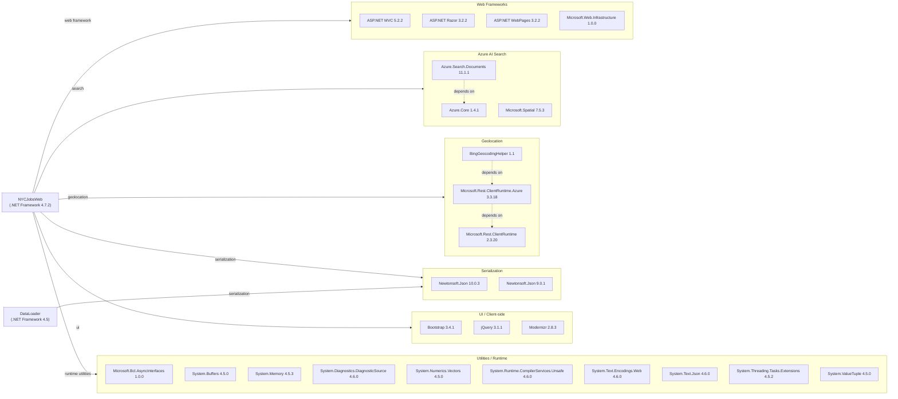

# Dependency Map

This document maps all declared external dependencies for the NYCJobsWeb solution (2 projects: `NYCJobsWeb` targeting .NET Framework 4.7.2 and `DataLoader` targeting .NET Framework 4.5), totalling 25 unique package references across both projects.

## Dependencies

### Dependency Summary

| Category | Count | Key Libraries | Notes |
|----------|-------|--------------|-------|
| Web Frameworks | 4 | ASP.NET MVC 5.2.2, Razor 3.2.2, WebPages 3.2.2 | Legacy MVC stack on .NET Framework 4.7.2; not cross-platform |
| Azure AI Search | 3 | Azure.Search.Documents 11.1.1, Azure.Core 1.4.1, Microsoft.Spatial 7.5.3 | Outdated SDK; current GA is 11.6.x |
| Geolocation | 3 | BingGeocodingHelper 1.1, Microsoft.Rest.ClientRuntime 2.3.20 | Old Bing geocoding helper; not the modern Azure Maps SDK |
| Serialization | 2 | Newtonsoft.Json 10.0.3 (web), 9.0.1 (DataLoader) | Two different versions across projects |
| UI / Client-side | 3 | Bootstrap 3.4.1, jQuery 3.1.1, Modernizr 2.8.3 | All significantly outdated client-side libraries |
| Utilities / Runtime | 10 | System.Buffers, System.Memory, System.Text.Json, etc. | Polyfill packages backported for .NET Framework 4.7.2 compatibility |

### Version and Compatibility Risks

The entire web application runs on **.NET Framework 4.7.2**, which is in long-term maintenance mode and cannot run cross-platform (Linux/macOS) or in modern containerized environments without Windows. **Azure.Search.Documents 11.1.1** is multiple major patch versions behind the current 11.6.x release, meaning it is missing several years of bug fixes, performance improvements, and API additions. **BingGeocodingHelper 1.1** targets **.NET Framework 4.5** and wraps a deprecated geocoding API that has been superseded by Azure Maps; this library has not been updated since 2014. Client-side libraries **Bootstrap 3.4.1**, **jQuery 3.1.1**, and **Modernizr 2.8.3** are all multiple major versions behind their current releases and may contain known security vulnerabilities. **Newtonsoft.Json** is pinned at two different versions (10.0.3 and 9.0.1) across the two projects, which can cause subtle serialization differences if the tools ever share code.

### Notable Observations

- **No ORM or local database dependency**: The application relies entirely on Azure AI Search as its data backend — there are no Entity Framework, ADO.NET, or SQL client packages.
- **Polyfill package proliferation**: Ten `System.*` packages (Buffers, Memory, Text.Json, etc.) are present solely to backport .NET Core APIs to .NET Framework 4.7.2. These would be eliminated by upgrading to .NET 8+ or .NET 10.
- **BingGeocodingHelper is abandonware**: The `BingGeocodingHelper` NuGet package (v1.1) has not been updated since 2014, targets .NET 4.5, and wraps a Bing Maps REST endpoint that requires a separate API key configured in Web.config. Migration should consider Azure Maps SDK or a current geocoding client.
- **DataLoader uses legacy REST API version**: `AzureSearchHelper` hard-codes `api-version=2015-02-28-Preview` — a preview API that is over a decade old. This should be replaced with the current Azure AI Search SDK.

## Test Dependencies

No test project was detected in the solution. Neither `NYCJobsWeb.csproj` nor `DataLoader/DataLoader.csproj` declare any test-scoped packages (e.g., xUnit, NUnit, MSTest, Moq).

| Framework | Version | Notes |
|-----------|---------|-------|
| — | — | No test frameworks detected |

Total test-scope dependencies: 0

No automated test infrastructure is present in either project. Adding a modern test project with xUnit and a mocking library (e.g., Moq or NSubstitute) would be a prerequisite for safely migrating the application to .NET 10.
