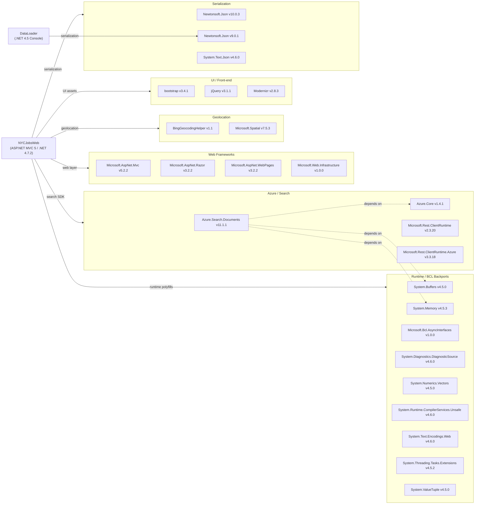

# Dependency Map

This document maps all external dependencies declared across the two projects of the NYC Jobs Search solution: **NYCJobsWeb** (ASP.NET MVC 5 web app, .NET 4.7.2) and **DataLoader** (.NET 4.5 console utility). A total of **25 unique external packages** are declared across both projects.

## Dependencies

### Dependency Summary

| Category | Count | Key Libraries | Notes |
|----------|-------|--------------|-------|
| Web Frameworks | 4 | Microsoft.AspNet.Mvc 5.2.2, Razor 3.2.2, WebPages 3.2.2 | Legacy ASP.NET MVC 5 stack on .NET Framework — not cross-platform |
| Azure / Search | 4 | Azure.Search.Documents 11.1.1, Azure.Core 1.4.1 | Azure Cognitive Search SDK; version 11.1.1 is several major versions behind current |
| Geolocation | 2 | BingGeocodingHelper 1.1, Microsoft.Spatial 7.5.3 | Bing Maps geocoding helper; Microsoft.Spatial is a legacy OData spatial library |
| UI / Front-end | 3 | Bootstrap 3.4.1, jQuery 3.1.1, Modernizr 2.8.3 | Bootstrap 3.x is end-of-life; Modernizr is largely obsolete for modern browsers |
| Serialization | 3 | Newtonsoft.Json 10.0.3 (web), 9.0.1 (DataLoader), System.Text.Json 4.6.0 | Two different Newtonsoft.Json versions used across projects |
| Runtime / BCL Backports | 9 | System.Buffers, System.Memory, AsyncInterfaces, DiagnosticSource | Polyfill packages needed to run newer Azure SDK on .NET 4.7.2 |

### Version & Compatibility Risks

The entire web application targets **.NET Framework 4.7.2**, which is in long-term maintenance mode with no new feature development. The **ASP.NET MVC 5.2.2** stack does not run on .NET Core or .NET 5+, making cloud-native deployment options (e.g., Linux containers) unavailable without a framework migration. **Azure.Search.Documents 11.1.1** was released in 2020 and is several major versions behind the current SDK (12.x), which may lack support for newer Azure AI Search features such as vector search and semantic ranking. **Bootstrap 3.4.1** is end-of-life since 2019 and has known security advisories. **Modernizr 2.8.3** is largely unnecessary for modern browser targets. The **DataLoader** project uses **Newtonsoft.Json 9.0.1** while the web project uses 10.0.3, creating a version split that could cause subtle serialization differences. The nine BCL backport packages (System.Buffers, System.Memory, etc.) are required solely to bridge the gap between .NET 4.7.2 and the modern Azure SDK, and would be unnecessary after a migration to .NET 8+.

### Notable Observations

- **Dual serialization libraries**: Both `Newtonsoft.Json` and `System.Text.Json` are present in NYCJobsWeb. `System.Text.Json` appears as a transitive dependency of Azure.Search.Documents, while `Newtonsoft.Json` is used directly in the DataLoader. This redundancy should be unified to a single serializer during modernization.
- **Nine BCL polyfill packages**: The large number of runtime backport packages (System.Buffers, System.Memory, System.Numerics.Vectors, etc.) exists only to bridge .NET 4.7.2 with the modern Azure SDK. Migrating to .NET 8+ would eliminate all of these.
- **No logging framework declared**: Neither project declares a structured logging library (e.g., Serilog, NLog, or Microsoft.Extensions.Logging). All error handling uses `Console.WriteLine`, which is not suitable for production observability.
- **No DI / IoC container**: The web application does not use a dependency injection container. `JobsSearch` is instantiated directly inside `HomeController`, making unit testing and service replacement harder.

## Test Dependencies

No test-scope dependencies detected in either project (`NYCJobsWeb/packages.config` or `DataLoader/packages.config`).

Total test-scope dependencies: **0**

Neither project includes any unit or integration test framework (e.g., xUnit, MSTest, NUnit, Moq). Adding a test framework and writing tests should be a prerequisite for any modernization effort to protect against regressions.
