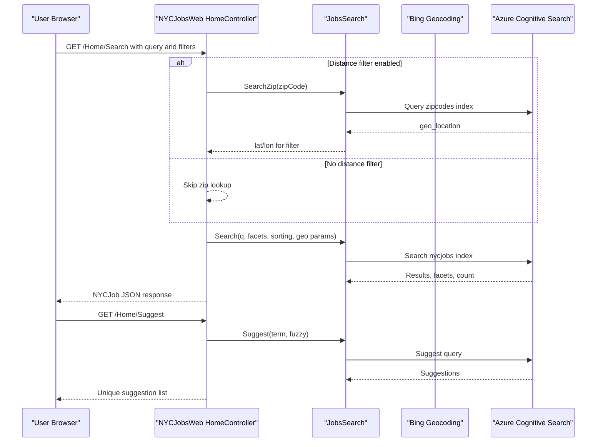

# API & Service Communication Contracts

The web application exposes a small MVC-based HTTP API surface through a single controller, with synchronous calls to Azure Cognitive Search and Bing geocoding.

## Service Catalog

| Service | Port | Category | Purpose |
|---|---|---|---|
| NYCJobsWeb | 51269 (IIS Express config) | API Layer | Serves UI pages and JSON search endpoints |
| DataLoader | N/A (console app) | Business | Backup/restore utility for search index content |

## API Endpoints Inventory

| Service | Method | Path | Request Type | Response Type |
|---|---|---|---|---|
| NYCJobsWeb | GET | /Home/Index | Query string none | Razor view |
| NYCJobsWeb | GET | /Home/JobDetails | Query string none | Razor view |
| NYCJobsWeb | GET | /Home/Search | Query params (`q`, facets, lat/lon, paging, zip, distance) | `NYCJob` JSON payload |
| NYCJobsWeb | GET | /Home/Suggest | Query params (`term`, `fuzzy`) | `List<string>` JSON |
| NYCJobsWeb | GET | /Home/LookUp | Query param (`id`) | `NYCJobLookup` JSON payload |

## Management & Observability Endpoints

| Service | Endpoint | Custom Metrics (if any) |
|---|---|---|
| NYCJobsWeb | None detected | None detected |

## DTOs & Contracts

`NYCJob` and `NYCJobLookup` are the main API response DTOs for search and lookup operations, while request contracts are query-string based parameters passed to controller actions. The API also exchanges `SearchDocument` objects from Azure SDK as internal response payloads. No OpenAPI/Swagger, protobuf, or GraphQL schema definitions were found.

## Communication Patterns

Communication is synchronous and request-response oriented. `HomeController` delegates to `JobsSearch`, which calls Azure Search clients (`Search`, `Suggest`, `GetDocument`) and optionally Bing geocoding for location-aware filtering. No asynchronous messaging, retry policy library, circuit breaker, or service discovery mechanism was detected. API-level authentication, authorization, and TLS enforcement are not configured in code; endpoints appear publicly accessible at application level.

## Service Technology Matrix

| Service | Web | Data Access | Discovery | Gateway | Actuator | Cache | Metrics |
|---|---|---|---|---|---|---|---|
| NYCJobsWeb | ASP.NET MVC | Azure.Search.Documents SDK | None | None | None | None | None |
| DataLoader | Console | HTTP/Azure Search helper logic | None | None | None | None | None |

## Service Communication Sequence

