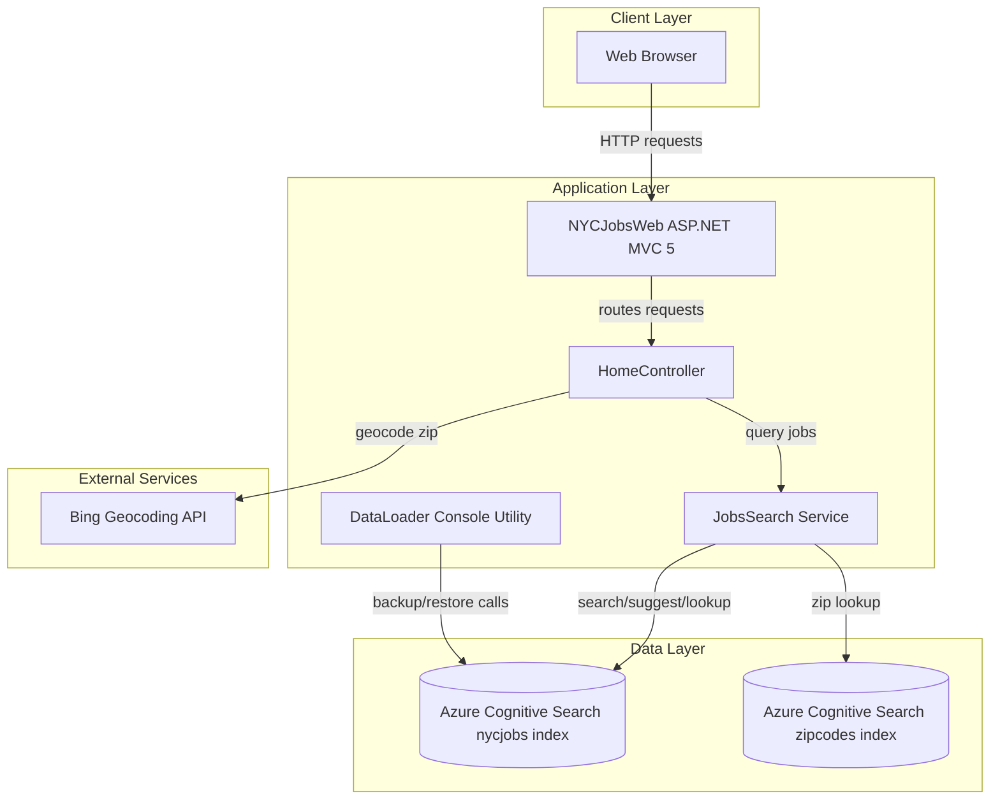
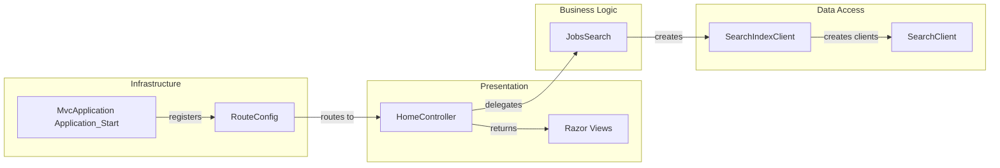

# Architecture Diagram

This repository contains a legacy ASP.NET MVC web application and a supporting .NET console utility that both interact with Azure Cognitive Search.

## Application Architecture

### Technology Stack Summary

| Layer | Technology | Version | Purpose |
|---|---|---|---|
| Presentation | ASP.NET MVC | 5.2.2 | Server-rendered web UI and JSON endpoints |
| Application | .NET Framework | 4.7.2 (web), 4.5 (loader) | Business logic and integration |
| Data Access | Azure.Search.Documents SDK | 11.1.1 | Query Azure Cognitive Search indexes |
| External Integration | BingGeocodingHelper | 1.1 | Resolve ZIP/geolocation inputs |

### Data Storage & External Services

The application relies on Azure Cognitive Search indexes (`nycjobs` and `zipcodes`) as its primary data source rather than a relational database. It also integrates with Bing geocoding to support location-aware filtering in search requests.

### Key Architectural Decisions

- Uses a thin MVC controller that delegates search operations to a dedicated `JobsSearch` service.
- Uses Azure Cognitive Search as the operational query store for job content and facets.
- Keeps backup/restore capabilities in a separate console application (`DataLoader`).

## Component Relationships

### Component Inventory

| Component | Layer | Type | Responsibility |
|---|---|---|---|
| HomeController | Presentation | MVC Controller | Handles search/suggest/lookup requests |
| Index.cshtml / JobDetails.cshtml | Presentation | Razor Views | Renders UI pages |
| JobsSearch | Business Logic | Service Class | Builds search options and executes queries |
| SearchIndexClient/SearchClient | Data Access | Azure SDK Clients | Communicate with search indexes |
| RouteConfig | Infrastructure | Route Registration | Defines MVC route template |
| MvcApplication | Infrastructure | Startup Class | Bootstraps MVC routing |
