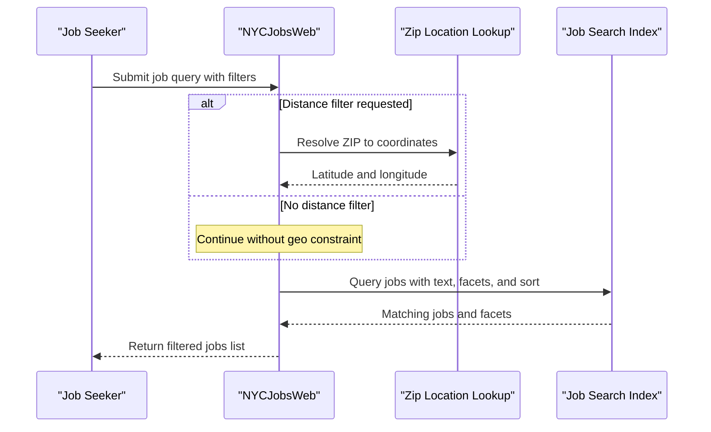

# Core Business Workflows

The application supports job-discovery workflows for users browsing and filtering NYC job postings, plus operational backup/restore workflows for search index content.

## Domain Entities

| Entity | Service / Bounded Context | Description | Key Relationships |
|---|---|---|---|
| Job Posting | Job Search (NYCJobsWeb) | Searchable job listing shown to users | Grouped into search results/facets |
| Job Search Result | Job Search (NYCJobsWeb) | Aggregated result page payload | Contains multiple job postings |
| Job Lookup Result | Job Search (NYCJobsWeb) | Single-record job details payload | Wraps one search document |
| Zip Location | Location Filter (NYCJobsWeb) | ZIP-based geolocation used for filtering | Used to constrain job queries |

## Service-to-Domain Mapping

| Service | Domain Context | Owned Entities | External Dependencies |
|---|---|---|---|
| NYCJobsWeb | Job Discovery UI/API | Job Search Result, Job Lookup Result | Azure Cognitive Search, Bing Geocoding |
| DataLoader | Search Data Operations | Backup payloads of job index data | Azure Cognitive Search |

## Primary Workflows

### Workflow 1: Search Jobs with Optional Distance Filter

1. User submits search text and optional facets on the home page.
2. If distance filtering is requested, the app resolves ZIP code to coordinates.
3. App executes search with filters/sorting and retrieves matching jobs/facets.
4. Response is returned as JSON for UI rendering.

### Workflow 2: Get Suggestions and Job Details

1. User types into search box and requests suggestions.
2. System queries suggest API and removes duplicates.
3. User selects an item; app can request a detailed document by ID.

### Workflow 3: Backup/Restore Search Data (DataLoader)

1. Operator configures target search service settings.
2. Utility reads/writes index content through helper routines.
3. Operation completes with updated search index state.

## Cross-Service Data Flows

The web app directly composes user-facing data from two external sources: ZIP geolocation lookup and job index query results. There is no internal multi-service choreography; composition happens inside the `HomeController` + `JobsSearch` flow before returning a single response payload.

## Business Workflow Sequence

## Business Rules & Decision Logic

- Blank search text is normalized to wildcard (`*`) so users always get results.
- Distance filtering is conditional and only applied when `maxDistance > 0`.
- Sorting behavior is rule-based (`featured`, salary ascending/descending, most recent).
- Suggestion workflow deduplicates suggestions before returning data.
- Lookup workflow returns no payload when ID is absent.
