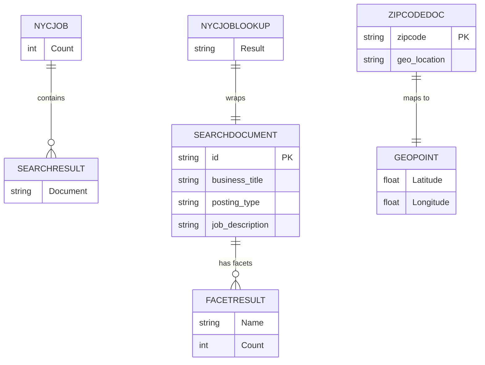

# Data Architecture & Persistence Layer

The data layer is centered on Azure Cognitive Search indexes rather than a traditional relational database, with lightweight DTO models in the web project.

## Database Configuration

| Service/Module | DB Type | Profile | Driver | Connection | Migration Tool |
|---|---|---|---|---|---|
| NYCJobsWeb | Azure Cognitive Search index store | Default | Azure.Search.Documents SDK | `Searchendpoint` + API key from `Web.config` | None detected |
| DataLoader | Azure Cognitive Search index store | Default | HTTP client + Newtonsoft.Json | Target search service/app settings in `App.config` | None detected |

## Data Ownership per Service

| Service | Tables Owned | ORM Framework | Caching | Notes |
|---|---|---|---|---|
| NYCJobsWeb | `nycjobs` index documents, `zipcodes` index documents (consumed) | None (search-document model) | None detected | Reads and shapes search results for UI/API responses |
| DataLoader | Search documents during backup/restore operations | None | None detected | Utility process for data movement |

## Entity Model

## Key Repository Methods

| Service | Repository | Notable Methods | Purpose |
|---|---|---|---|
| NYCJobsWeb | `JobsSearch` (`NYCJobsWeb/JobsSearch.cs`) | `Search(...)`, `SearchZip(...)`, `Suggest(...)`, `LookUp(...)` | Query/search/suggest/lookup operations against indexes |
| DataLoader | `AzureSearchHelper` (`DataLoader/DataLoader/AzureSearchHelper.cs`) | Backup/restore helper methods | Export/import index documents |

## Caching Strategy

No explicit caching provider or cache-aside logic was detected. All reads appear to be served directly from Azure Cognitive Search on each request.

## Data Ownership Boundaries

Both projects share access to the same search service boundary. The web application is the query-serving surface, while DataLoader performs administrative data movement. Cross-service access is direct to search indexes rather than through internal service APIs.

### Data Classification & Sensitivity

| Entity | Sensitive Fields | Classification (PII/PHI/PCI/None) | Controls in Place |
|---|---|---|---|
| SEARCHDOCUMENT (job postings) | Work location text may include location data | PII (potential) | No explicit encryption/masking controls in code |
| App configuration entries | Search service API key | Sensitive credential | Stored as configuration values/placeholders |
