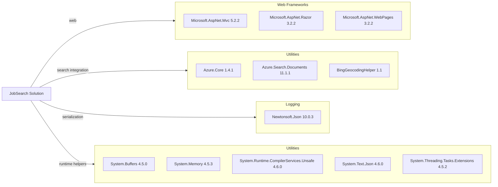

# Dependency Map

This repository has two .NET Framework projects with a moderate dependency footprint focused on web UI and Azure Cognitive Search integration.

## Dependencies

### Dependency Summary

| Category | Count | Key Libraries | Notes |
|---|---:|---|---|
| Web Frameworks | 3 | Microsoft.AspNet.Mvc, Razor, WebPages | Legacy ASP.NET MVC stack |
| Utilities | 8 | Azure.Search.Documents, Azure.Core, System.Text.Json | Search SDK and compatibility helpers |
| Logging | 1 | Newtonsoft.Json | JSON serialization used in both projects |
| Security | 0 | None detected | No auth-specific package declared |

### Version & Compatibility Risks

The projects target .NET Framework 4.7.2 and 4.5, which introduces upgrade pressure and compatibility work for modernization. Several support libraries are older versions pinned via `packages.config`, which typically requires migration to newer packages and/or PackageReference during upgrades.

### Notable Observations

- Uses `packages.config` instead of modern PackageReference dependency management.
- Multiple legacy ASP.NET MVC packages indicate tight coupling to System.Web.
- DataLoader and web app use different Newtonsoft.Json major versions (9.0.1 vs 10.0.3).
- Search functionality depends on Azure.Search.Documents as the primary external integration.

## Test Dependencies

| Framework | Version | Notes |
|---|---|---|
| None detected | N/A | No test project/package references found |

Total test-scope dependencies: 0
No test dependencies detected.
