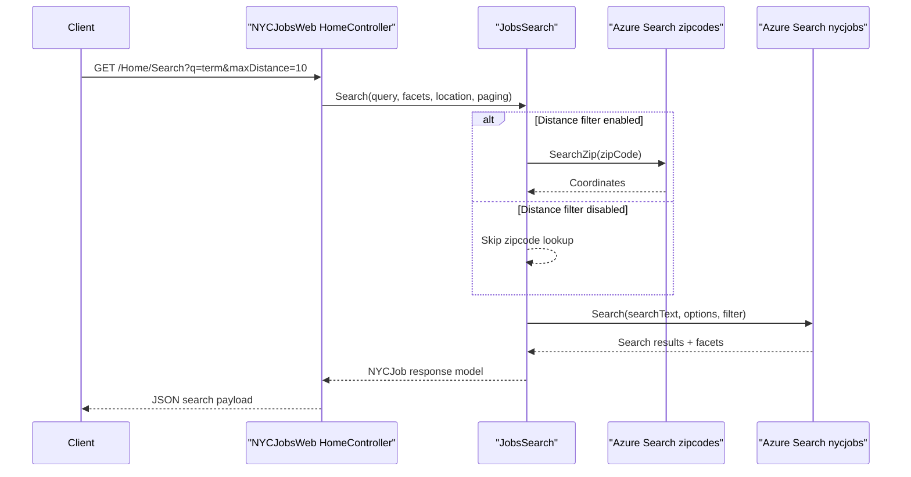

# API & Service Communication Contracts

The application exposes a small MVC-based HTTP API surface for job search and job detail retrieval, with synchronous communication to Azure Search and a geocoding helper service.

## Service Catalog

| Service | Port | Category | Purpose |
|---|---|---|---|
| NYCJobsWeb | 51269 (IIS Express dev URL) | API Layer | Serves web UI and JSON search endpoints |
| DataLoader | N/A (console app) | Business | Seeds and recreates Azure Search indexes |
| Azure AI Search | 443 | Infrastructure | Stores and serves searchable job and zipcode indexes |
| Bing Geocoding API | 443 | Infrastructure | Resolves geolocation for zip-based distance filtering |

## API Endpoints Inventory

| Service | Method | Path | Request Type | Response Type |
|---|---|---|---|---|
| NYCJobsWeb/HomeController | GET | /Home/Index | Query string optional | Razor view |
| NYCJobsWeb/HomeController | GET | /Home/JobDetails | Query string optional | Razor view |
| NYCJobsWeb/HomeController | GET | /Home/Search | Query params (`q`, facets, location, pagination) | JSON `NYCJob` payload |
| NYCJobsWeb/HomeController | GET | /Home/Suggest | Query params (`term`, `fuzzy`) | JSON string list |
| NYCJobsWeb/HomeController | GET | /Home/LookUp | Query param (`id`) | JSON `NYCJobLookup` payload |

## Management & Observability Endpoints

| Service | Endpoint | Custom Metrics (if any) |
|---|---|---|
| NYCJobsWeb | None detected | None detected |
| DataLoader | None detected | None detected |

## DTOs & Contracts

The API contracts are represented by `NYCJob` (search responses with results/facets/count) and `NYCJobLookup` (single-document detail response). Request contracts are primarily query-string parameters in controller actions rather than dedicated request DTO classes. OpenAPI/Swagger and protobuf/GraphQL schemas were not found.

## Communication Patterns

Communication is synchronous request/response: browser calls MVC endpoints; controller delegates to `JobsSearch`; `JobsSearch` calls Azure Search SDK clients for search/suggest/lookup and optionally queries zipcode index for distance-based filtering. No asynchronous messaging, circuit breaker, retry framework, or service discovery mechanism was detected. API-level authentication/authorization and explicit TLS enforcement settings are not configured in the codebase; endpoint security appears dependent on hosting defaults.

## Service Technology Matrix

| Service | Web | Data Access | Discovery | Gateway | Actuator | Cache | Metrics |
|---|---|---|---|---|---|---|---|
| NYCJobsWeb | ASP.NET MVC 5 | Azure.Search.Documents SDK | None | None | None | None | None |
| DataLoader | Console .NET app | HttpClient + JSON files + Azure Search REST | None | None | None | None | None |

## Service Communication Sequence

