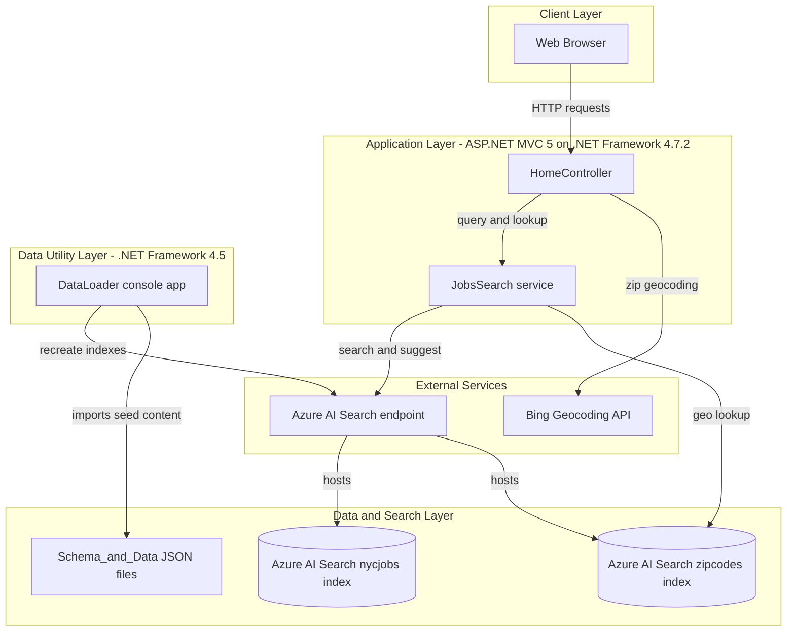
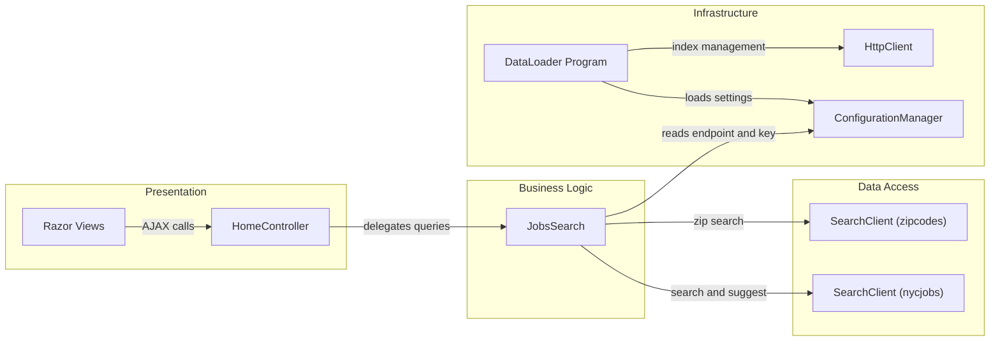

# Architecture Diagram

This repository contains a legacy ASP.NET MVC web application and a companion data loader utility that together power a searchable NYC jobs demo.

## Application Architecture

### Technology Stack Summary

| Layer | Technology | Version | Purpose |
|---|---|---|---|
| Presentation | ASP.NET MVC | 5.2.2 | Serves views and JSON endpoints |
| Application | .NET Framework | 4.7.2 (web), 4.5 (loader) | Runtime for web and loader apps |
| Search/Data Access | Azure.Search.Documents SDK | 11.1.1 | Query, suggest, and lookup against Azure AI Search |
| Utility | Newtonsoft.Json | 9.0.1 / 10.0.3 | JSON serialization for data import and responses |

### Data Storage & External Services

The solution uses Azure AI Search indexes (`nycjobs`, `zipcodes`) as the primary data store surface instead of a relational database. External dependencies include Azure AI Search for indexing/query and Bing Geocoding for location-related query behavior.

### Key Architectural Decisions

- Uses a thin MVC controller layer with a centralized `JobsSearch` service wrapper for search client operations.
- Keeps indexing and data seed upload in a separate console utility (`DataLoader`) rather than inside the web application runtime.
- Relies on configuration-based service endpoints and API keys in `Web.config` / `App.config`.

## Component Relationships

### Component Inventory

| Component | Layer | Type | Responsibility |
|---|---|---|---|
| HomeController | Presentation | MVC Controller | Handles search, suggest, and lookup endpoints |
| Index.cshtml / JobDetails.cshtml | Presentation | Razor Views | Renders UI pages for job searching |
| JobsSearch | Business Logic | Service class | Encapsulates Azure Search query/suggest/lookup operations |
| SearchClient (`nycjobs`) | Data Access | SDK client | Executes search and facet requests |
| SearchClient (`zipcodes`) | Data Access | SDK client | Resolves zip code geolocation data |
| Program (DataLoader) | Infrastructure | Console entrypoint | Recreates indexes and imports seed data |
| AzureSearchHelper | Infrastructure | Utility class | Sends REST requests and JSON serialization for loader |
