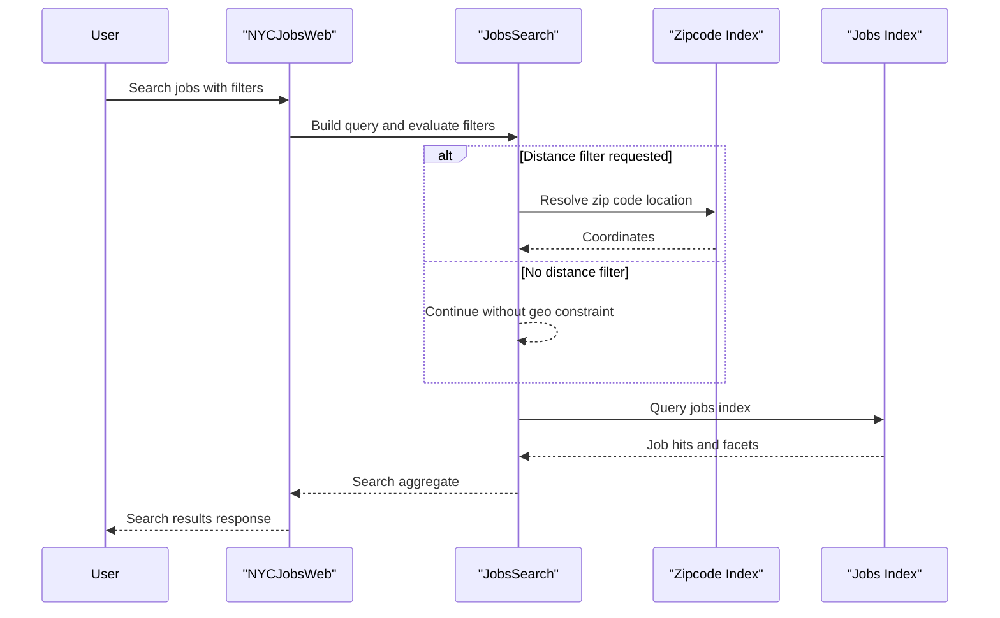

# Core Business Workflows

The application supports job discovery workflows for end users and a companion administrative workflow for loading searchable content into Azure Search indexes.

## Domain Entities

| Entity | Service / Bounded Context | Description | Key Relationships |
|---|---|---|---|
| Job Listing | NYCJobsWeb Search context | Represents an indexed NYC job posting returned to users | Returned in search results and detail lookups |
| Zipcode Location | NYCJobsWeb Search context | Maps zip code input to geolocation for distance filtering | Used to enrich search filtering |
| Search Result Aggregate (`NYCJob`) | NYCJobsWeb Presentation context | Composite response with result set, facets, and total count | Wraps multiple job listing hits |
| Index Schema/Data Files | DataLoader Ingestion context | Source schema and JSON documents used for index creation | Loaded into Azure Search indexes |

## Service-to-Domain Mapping

| Service | Domain Context | Owned Entities | External Dependencies |
|---|---|---|---|
| NYCJobsWeb | Job Search and Discovery | Job Listing, Zipcode Location, Search Result Aggregate | Azure AI Search, Bing Geocoding |
| DataLoader | Index Provisioning and Data Seeding | Index Schema/Data Files | Azure AI Search REST API |

## Primary Workflows

### Workflow 1: Search jobs with optional distance filter

1. User opens the search page and submits keywords/facets.
2. `HomeController.Search` validates and normalizes query input (`*` when blank).
3. If distance filtering is requested, `JobsSearch.SearchZip` resolves coordinates by zip code.
4. `JobsSearch.Search` executes Azure Search query with facets/sorting/filters.
5. Controller returns a JSON aggregate (`NYCJob`) to the UI.

### Workflow 2: View job details

1. User selects a specific job from search results.
2. UI requests `HomeController.LookUp` with the job id.
3. `JobsSearch.LookUp` retrieves one search document.
4. Controller returns `NYCJobLookup` payload for detail display.

### Workflow 3: Seed and refresh search indexes

1. Operator runs DataLoader with target service credentials.
2. Program deletes existing indexes (`zipcodes`, `nycjobs`).
3. Program recreates indexes from schema files.
4. Program uploads JSON documents to each index.

## Cross-Service Data Flows

The user-facing service composes data from Azure Search indexes and optional geocoding resolution in a synchronous request chain. The ingestion utility provides upstream data population for the same indexes. If zipcode lookup or search calls fail, the workflow degrades by returning null/empty behavior and logging console errors rather than orchestrating fallback services.

## Business Workflow Sequence

## Business Rules & Decision Logic

- Empty search text is converted to wildcard search (`*`) to avoid null-query behavior.
- Search sorting decision is conditional (`featured`, `salaryDesc`, `salaryIncr`, `mostRecent`).
- Facet and distance filters are composed incrementally into a single search filter expression.
- DataLoader enforces a deterministic sequence for index refresh: delete → create → import.
