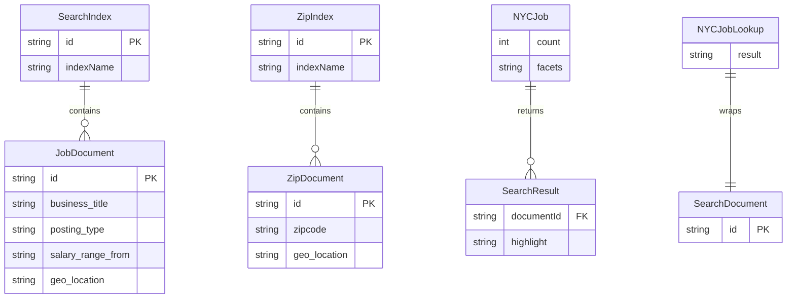

# Data Architecture & Persistence Layer

The solution uses Azure AI Search indexes as the primary persistence layer, with a lightweight domain model for response contracts and a console utility that loads schema and seed data.

## Database Configuration

| Service/Module | DB Type | Profile | Driver | Connection | Migration Tool |
|---|---|---|---|---|---|
| NYCJobsWeb | Azure AI Search indexes | Default (Web.config) | Azure.Search.Documents 11.1.1 | `Searchendpoint` + `SearchServiceApiKey` app settings | None detected |
| DataLoader | Azure AI Search indexes | Default (App.config) | HttpClient + REST | `TargetSearchServiceName` + `TargetSearchServiceApiKey` app settings | File-driven schema creation (`*.schema`) |

## Data Ownership per Service

| Service | Tables Owned | ORM Framework | Caching | Notes |
|---|---|---|---|---|
| NYCJobsWeb | `nycjobs` index documents, `zipcodes` index documents (logical ownership via queries) | None (SDK query model) | None detected | Read/query focused service |
| DataLoader | Schema and seed JSON under `Schema_and_Data` | None (raw HTTP + JSON) | None detected | Recreates indexes and bulk imports documents |

## Entity Model

## Key Repository Methods

| Service | Repository | Notable Methods | Purpose |
|---|---|---|---|
| NYCJobsWeb | `JobsSearch` (`NYCJobsWeb/JobsSearch.cs`) | `Search(...)`, `SearchZip(...)`, `Suggest(...)`, `LookUp(...)` | Encapsulates all search index interactions |
| DataLoader | `Program` + `AzureSearchHelper` | `CreateTargetIndex(...)`, `ImportFromJSON(...)`, `SendSearchRequest(...)` | Creates indexes and uploads seed documents |

## Caching Strategy

No explicit application cache provider or cache annotations were detected. Data is fetched directly from Azure Search on each request.

## Data Ownership Boundaries

The repository follows a shared external data-store pattern where both modules interact with the same Azure Search service but with different responsibilities: `DataLoader` owns write/reseed operations and `NYCJobsWeb` owns read/query behavior. Cross-module integration happens through shared index names and document shape conventions rather than direct code-level repository sharing.

### Data Classification & Sensitivity

| Entity | Sensitive Fields | Classification (PII/PHI/PCI/None) | Controls in Place |
|---|---|---|---|
| JobDocument | Work location text may include location details | PII (possible indirect) | No explicit masking/encryption controls in code |
| ZipDocument | Zip code and geolocation | PII (location-related) | No explicit masking/encryption controls in code |
| NYCJob / NYCJobLookup | Mirrors index payload fields | PII (inherited from source data) | No explicit field-level controls detected |
