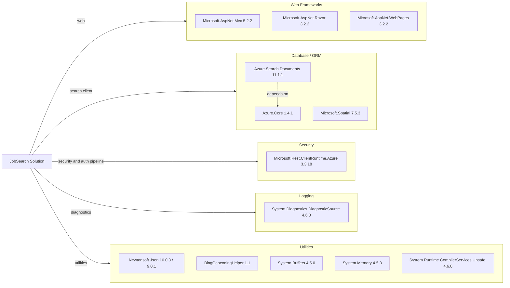

# Dependency Map

This solution declares 20+ external packages across a legacy ASP.NET MVC web project and a .NET Framework data loader utility.

## Dependencies

### Dependency Summary

| Category | Count | Key Libraries | Notes |
|---|---:|---|---|
| Web Frameworks | 3 | ASP.NET MVC, Razor, WebPages | Legacy MVC stack on .NET Framework |
| Database / ORM | 3 | Azure.Search.Documents, Azure.Core, Microsoft.Spatial | Search index access instead of relational ORM |
| Security | 1 | Microsoft.Rest.ClientRuntime.Azure | Azure service integration support |
| Logging | 1 | System.Diagnostics.DiagnosticSource | Runtime diagnostics instrumentation |
| Utilities | 8+ | Newtonsoft.Json, BingGeocodingHelper, System.* helpers | Includes compatibility libraries for net472 |

### Version & Compatibility Risks

Several packages are tied to .NET Framework-era versions (MVC 5.2.2, Razor 3.2.2, Newtonsoft.Json 9/10 split), which can increase migration effort to modern .NET runtimes. The project also relies on `packages.config`, indicating older package management patterns.

### Notable Observations

- The web app and loader use different Newtonsoft.Json versions (10.0.3 vs 9.0.1).
- Search functionality depends heavily on Azure.Search.Documents and related support libraries.
- No dedicated ORM package is present; persistence is handled through Azure Search clients and files.
- Client-side dependencies (bootstrap, jQuery, Modernizr) are legacy versions.

## Test Dependencies

| Framework | Version | Notes |
|---|---|---|
| None detected | N/A | No test-scoped packages or test project files found |

Total test-scope dependencies: 0
No test infrastructure dependencies were detected in `packages.config` files.
