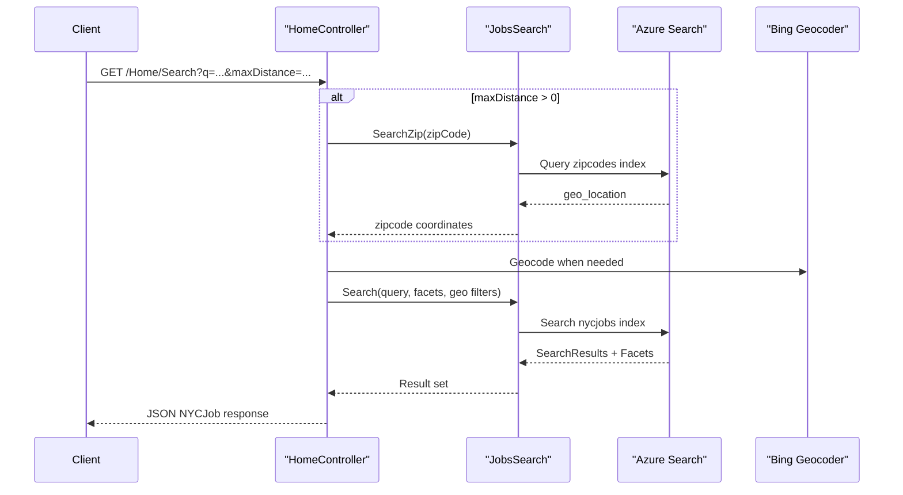

# API & Service Communication Contracts

The solution exposes a small set of MVC JSON endpoints from a single web service and uses synchronous calls to Azure Search and Bing geocoding without asynchronous messaging.

## Service Catalog

| Service | Port | Category | Purpose |
|---|---|---|---|
| NYCJobsWeb | 51269 (IIS Express dev) | API Layer | Serves MVC pages and JSON search endpoints for NYC jobs |
| DataLoader | N/A (console) | Infrastructure | Rebuilds and imports Azure Search index data |

## API Endpoints Inventory

| Service | Method | Path | Request Type | Response Type |
|---|---|---|---|---|
| NYCJobsWeb/HomeController | GET | `/Home/Index` | None | HTML view |
| NYCJobsWeb/HomeController | GET | `/Home/JobDetails` | Query string | HTML view |
| NYCJobsWeb/HomeController | GET | `/Home/Search` | Query params (`q`, facets, paging, location) | JSON `NYCJob` |
| NYCJobsWeb/HomeController | GET | `/Home/Suggest` | Query params (`term`, `fuzzy`) | JSON `List<string>` |
| NYCJobsWeb/HomeController | GET | `/Home/LookUp` | Query param (`id`) | JSON `NYCJobLookup` |

## Management & Observability Endpoints

| Service | Endpoint | Custom Metrics (if any) |
|---|---|---|
| NYCJobsWeb | None detected (`/health`, `/swagger` absent) | None |

## DTOs & Contracts

The API contract uses `NYCJob` as the aggregated search response shape and `NYCJobLookup` for single-document retrieval. Request payloads are query-string driven (no body DTOs). Search documents are represented through `Azure.Search.Documents.Models.SearchDocument`, and no OpenAPI/Swagger/protobuf/GraphQL contract files were detected.

## Communication Patterns

Communication is synchronous and request/response based: browser to MVC controller, then controller to `JobsSearch`, and finally SDK calls to Azure Search. There is no asynchronous messaging, service discovery, client-side load balancing, retry policy, or circuit-breaker library in the codebase. Startup ordering is simple because only the MVC app must be online for API availability. Security posture at API level: no explicit authentication/authorization attributes or TLS enforcement logic in code, so endpoint protection depends on hosting configuration.

## Service Technology Matrix

| Service | Web | Data Access | Discovery | Gateway | Actuator | Cache | Metrics |
|---|---|---|---|---|---|---|---|
| NYCJobsWeb | ASP.NET MVC 5 | Azure Search SDK (`SearchClient`) | None | None | No | None | None |
| DataLoader | Console app | Azure Search REST via `HttpClient` | None | None | N/A | None | None |

## Service Communication Sequence

