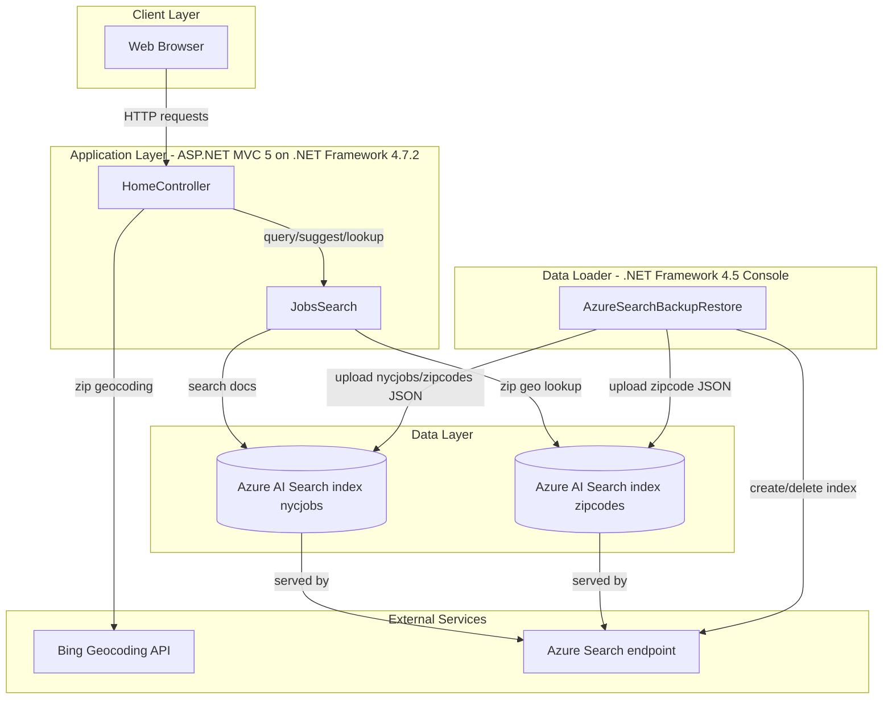
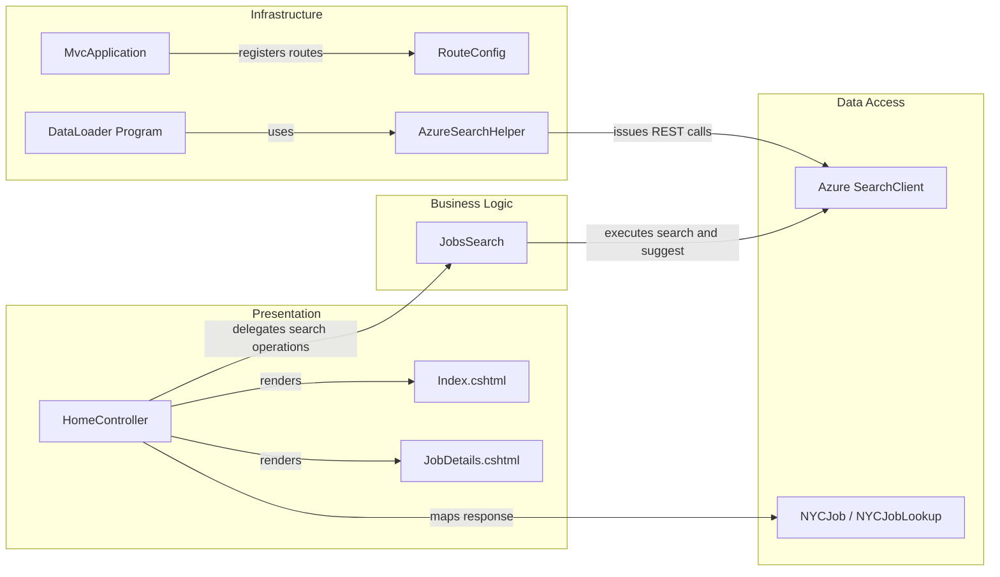

# Architecture Diagram

This solution contains a legacy ASP.NET MVC web app and a console data-loader utility, both centered on Azure AI Search indexes for NYC jobs and zipcode geodata.

## Application Architecture

### Technology Stack Summary

| Layer | Technology | Version | Purpose |
|---|---|---|---|
| Presentation | ASP.NET MVC | 5.2.2 | Server-rendered UI and JSON endpoints |
| Application | .NET Framework | 4.7.2 / 4.5 | Web app and import utility runtime |
| Search/Data | Azure.Search.Documents SDK | 11.1.1 | Query Azure Search indexes |
| Integration | BingGeocodingHelper | 1.1 | Convert zipcode to coordinates for distance filtering |

### Data Storage & External Services

The application does not use a relational database. It depends on Azure AI Search indexes (`nycjobs`, `zipcodes`) as its primary data store and uses Bing geocoding to support location-based filtering.

### Key Architectural Decisions

- The web app delegates all search behavior to a single `JobsSearch` service class used directly by `HomeController`.
- Search results are returned as JSON payloads to the browser while MVC views are used for initial page rendering.
- A separate console utility owns index re-creation and JSON-based bulk data import.

## Component Relationships

### Component Inventory

| Component | Layer | Type | Responsibility |
|---|---|---|---|
| HomeController | Presentation | MVC Controller | Handles search, suggest, lookup, and view routes |
| JobsSearch | Business Logic | Service class | Builds Azure Search queries and filters |
| NYCJob / NYCJobLookup | Data Access | DTO model | Shapes API JSON payloads for UI consumption |
| RouteConfig | Infrastructure | Routing config | Maps default controller/action routes |
| MvcApplication | Infrastructure | App bootstrap | Registers areas/routes on startup |
| Program (DataLoader) | Infrastructure | Console entrypoint | Orchestrates index delete/create/import workflow |
| AzureSearchHelper | Infrastructure | HTTP helper | Sends Azure Search REST API requests |
