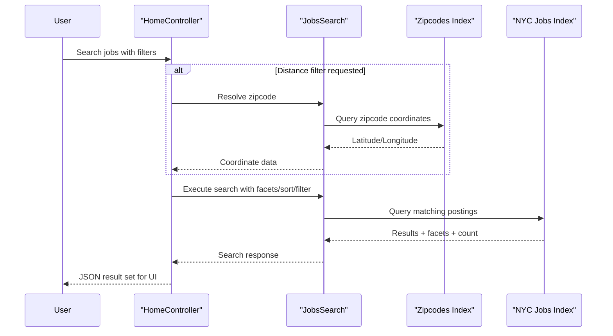

# Core Business Workflows

The application enables users to discover NYC job postings with filtering, suggestions, and detail lookup, while a separate utility refreshes search index content used by the web experience.

## Domain Entities

| Entity | Service / Bounded Context | Description | Key Relationships |
|---|---|---|---|
| Job Posting Document | Job Search (NYCJobsWeb) | Searchable job listing returned to users | Included in search result collections |
| Zipcode Geo Document | Job Search (NYCJobsWeb) | Zip-to-coordinate reference for distance filtering | Used to constrain job search radius |
| NYCJob | Job Search (NYCJobsWeb) | Response aggregate for results, facets, and count | Wraps many job posting documents |
| NYCJobLookup | Job Search (NYCJobsWeb) | Response wrapper for one job document | Contains exactly one looked-up document |
| Index Schema/Data Artifact | Index Management (DataLoader) | Source schema and JSON data files for import | Drives index create and document upload steps |

## Service-to-Domain Mapping

| Service | Domain Context | Owned Entities | External Dependencies |
|---|---|---|---|
| NYCJobsWeb | Job discovery and retrieval | NYCJob, NYCJobLookup, search query logic | Azure Search indexes, Bing geocoding |
| DataLoader | Index provisioning and ingestion | Index schema/data artifacts, import orchestration | Azure Search REST API |

## Primary Workflows

### Workflow 1: Search Jobs with Facets and Optional Distance Filter

1. User initiates search from the home page.
2. Controller normalizes empty query to wildcard and gathers facet/paging inputs.
3. If distance filtering is requested, zipcode is resolved to coordinates via zipcode index/geocoding.
4. `JobsSearch.Search` composes Azure Search options (select, facets, ordering, filters).
5. Results are returned as `NYCJob` JSON (results + facets + count).

### Workflow 2: Typeahead Suggestions and Job Detail Lookup

1. User enters a partial term; `Suggest` endpoint calls Azure Search suggester.
2. Duplicate suggestions are removed and returned as distinct values.
3. For a selected document ID, `LookUp` fetches a single job document and returns `NYCJobLookup`.

### Workflow 3: Rebuild Search Index Data

1. Operator runs DataLoader with target service credentials.
2. Tool deletes target indexes, recreates them from schema files, then uploads JSON batches.
3. Updated index content becomes available to the web search workflows.

## Cross-Service Data Flows

The runtime flow is primarily web-app-to-Azure-Search rather than microservice-to-microservice. DataLoader and NYCJobsWeb share the same search backend: DataLoader writes/rebuilds index data, and NYCJobsWeb reads/query-composes against that data. If Azure Search is unavailable, workflows fail with error output and no fallback path is implemented.

## Business Workflow Sequence

## Business Rules & Decision Logic

- Empty search input is converted to wildcard (`*`) to preserve browse-all behavior.
- Distance filtering only applies when `maxDistance > 0`; otherwise no geo constraint is added.
- Sort behavior is rule-based (`featured`, `salaryDesc`, `salaryIncr`, `mostRecent`).
- Suggest workflow enforces uniqueness via in-memory de-duplication before response.
- Index rebuild workflow strictly follows delete → create → upload order to ensure schema/data consistency.
