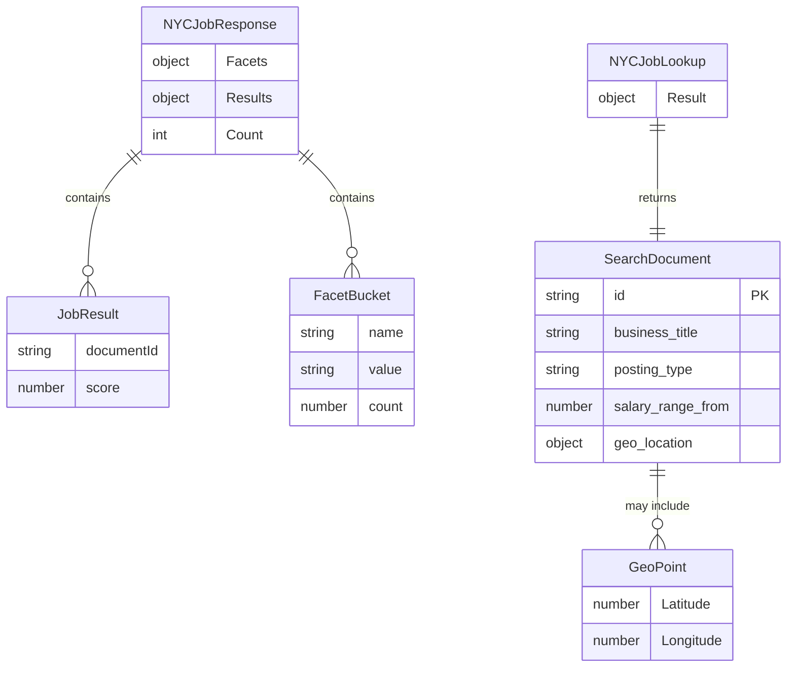

# Data Architecture & Persistence Layer

The data layer is centered on Azure AI Search document indexes rather than a relational ORM model, with lightweight DTOs in the web app and index schema/data files used by the loader utility.

## Database Configuration

| Service/Module | DB Type | Profile | Driver | Connection | Migration Tool |
|---|---|---|---|---|---|
| NYCJobsWeb | Azure AI Search (document index) | Default | Azure.Search.Documents SDK | Endpoint from `Searchendpoint` app setting + API key | None detected |
| DataLoader | Azure AI Search (REST) | Default | `HttpClient` + API key header | `https://{service}.search.windows.net` | None detected |

## Data Ownership per Service

| Service | Tables Owned | ORM Framework | Caching | Notes |
|---|---|---|---|---|
| NYCJobsWeb | Search indexes `nycjobs`, `zipcodes` (read/query) | None (SDK document access) | None | Query-only from web runtime |
| DataLoader | Search indexes `nycjobs`, `zipcodes` (schema + ingestion) | None (REST API) | None | Deletes/recreates indexes and uploads JSON batches |

## Entity Model

## Key Repository Methods

| Service | Repository | Notable Methods | Purpose |
|---|---|---|---|
| NYCJobsWeb | `JobsSearch` (`NYCJobsWeb/JobsSearch.cs`) | `Search(...)`, `SearchZip(...)`, `Suggest(...)`, `LookUp(...)` | Encapsulates all Azure Search query/read operations |
| DataLoader | `Program` + `AzureSearchHelper` (`DataLoader/DataLoader/*.cs`) | `DeleteIndex`, `CreateTargetIndex`, `ImportFromJSON`, `SendSearchRequest` | Manages index lifecycle and bulk ingest over REST |

## Caching Strategy

No explicit application-level caching provider or cache policy was detected in either project. All reads are direct calls to Azure Search at request time.

## Data Ownership Boundaries

The same Azure Search service is shared across modules: `DataLoader` acts as the write-side owner for index schema/documents, and `NYCJobsWeb` acts as the read-side query consumer. There is no database-per-service pattern and no CQRS/event stream beyond this loader-versus-reader split.

### Data Classification & Sensitivity

| Entity | Sensitive Fields | Classification (PII/PHI/PCI/None) | Controls in Place |
|---|---|---|---|
| SearchDocument (job records) | Work location text, potential contact-like data in job descriptions | PII (potential) | No field-level masking/encryption controls visible in app code |
| NYCJobResponse / NYCJobLookup | Inherits payload from SearchDocument | PII (potential) | No additional controls in code |

