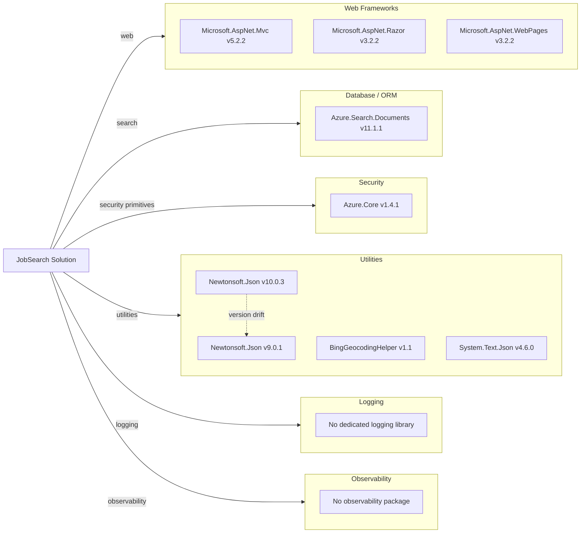

# Dependency Map

The repository defines two .NET Framework projects with a combined dependency surface focused on ASP.NET MVC, Azure Search SDKs, and supporting utilities.

## Dependencies

### Dependency Summary

| Category | Count | Key Libraries | Notes |
|---|---:|---|---|
| Web Frameworks | 3 | Microsoft.AspNet.Mvc, Razor, WebPages | Legacy ASP.NET MVC stack on .NET Framework |
| Database / ORM | 1 | Azure.Search.Documents | Search index acts as persistence/query layer |
| Security | 1 | Azure.Core | Provides credentials and HTTP abstractions |
| Utilities | 4 | Newtonsoft.Json, BingGeocodingHelper, System.Text.Json | Mixed utility stack across projects |
| Logging | 0 | None | Uses basic console/error output only |
| Observability | 0 | None | No metrics/tracing package detected |

### Version & Compatibility Risks

The solution targets .NET Framework 4.7.2 and 4.5 with older ASP.NET MVC-era dependencies, which creates migration pressure for modern .NET targets. JSON stack divergence (Newtonsoft.Json 9.x and 10.x) may create compatibility and behavior differences during upgrade.

### Notable Observations

- Web project uses `packages.config`, indicating non-SDK legacy dependency management.
- DataLoader and web project rely on different Newtonsoft.Json major versions.
- No resilience/observability libraries are present for external Azure Search calls.
- The legacy web project import chain depends on Visual Studio web build targets not present in this Linux runner.

## Test Dependencies

| Framework | Version | Notes |
|---|---|---|
| None detected | N/A | No test framework package declarations found |

Total test-scope dependencies: 0
No test dependencies detected.
