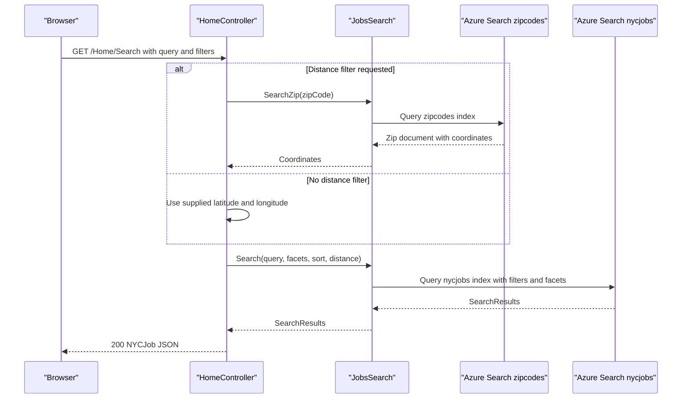

# API & Service Communication Contracts

The web application exposes a small ASP.NET MVC action surface for job search, suggestions, and lookup; communication is synchronous from browser to MVC actions and then to Azure AI Search.

## Service Catalog

| Service | Port | Category | Purpose |
|---|---:|---|---|
| NYCJobsWeb | 51269 in IIS Express project settings | API Layer | Serves MVC pages and JSON actions for searching NYC job postings |
| DataLoader | N/A | Infrastructure | Console utility that recreates and imports Azure AI Search index data |
| Azure AI Search | 443 | Infrastructure | External managed search service for `nycjobs` and `zipcodes` indexes |

## API Endpoints Inventory

| Service | Method | Path | Request Type | Response Type |
|---|---|---|---|---|
| NYCJobsWeb | GET | `/` or `/Home/Index` | No body | Razor view |
| NYCJobsWeb | GET | `/Home/JobDetails` | Optional route/query values rendered by client | Razor view |
| NYCJobsWeb | GET | `/Home/Search` | Query parameters: q, facets, sortType, lat, lon, currentPage, zipCode, maxDistance | `NYCJob` JSON containing Azure Search results, facets, and count |
| NYCJobsWeb | GET | `/Home/Suggest` | Query parameters: term, fuzzy | JSON array of unique suggestion strings |
| NYCJobsWeb | GET | `/Home/LookUp` | Query parameter or route value: id | `NYCJobLookup` JSON containing a single Azure Search document; null if id is absent |
| DataLoader | N/A | Console entry point | App.config service name and API-key settings | Console status output and Azure Search index side effects |

## Management & Observability Endpoints

| Service | Endpoint | Custom Metrics (if any) |
|---|---|---|
| NYCJobsWeb | None detected | None detected |
| DataLoader | None detected | None detected |

## DTOs & Contracts

`NYCJob` and `NYCJobLookup` are gateway-level response models used to serialize Azure Search SDK results to the browser. Azure SDK types such as `SearchDocument`, `SearchResult<SearchDocument>`, `FacetResult`, `SearchResults<SearchDocument>`, and `SuggestResults<SearchDocument>` form the service-level contracts with Azure AI Search. DTOs are mutable C# classes rather than immutable records, and JSON serialization is handled by ASP.NET MVC plus the Azure SDK result types. No OpenAPI, Swagger, GraphQL, or protobuf schema was found.

## Communication Patterns

All application communication is synchronous. Browser requests call MVC actions, MVC actions directly call `JobsSearch`, and `JobsSearch` uses the Azure Search SDK over HTTPS. `DataLoader` uses `HttpClient` to call the Azure Search REST API over HTTPS and supplies the API version query parameter on each request. No asynchronous messaging, service discovery, client-side load balancing, circuit breaker, retry policy, or explicit timeout policy was detected. Startup ordering is manual: Azure Search indexes and configuration must exist before the web actions can return results. No `[Authorize]` attributes, authentication middleware, role checks, or application-level TLS enforcement were found; endpoints are publicly accessible at the MVC layer, while Azure Search access is protected by API keys in configuration.

## Service Technology Matrix

| Service | Web | Data Access | Discovery | Gateway | Actuator | Cache | Metrics |
|---|---|---|---|---|---|---|---|
| NYCJobsWeb | ASP.NET MVC 5 | Azure Search SDK | None | None | None | None | None |
| DataLoader | None | Azure Search REST API | None | None | None | None | None |

## Service Communication Sequence

