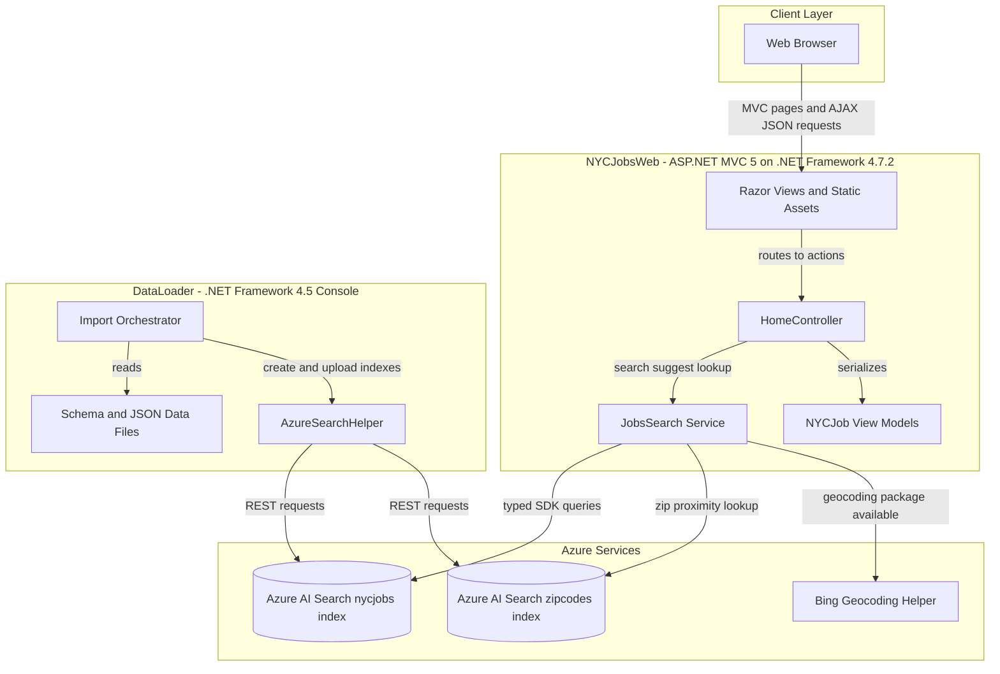
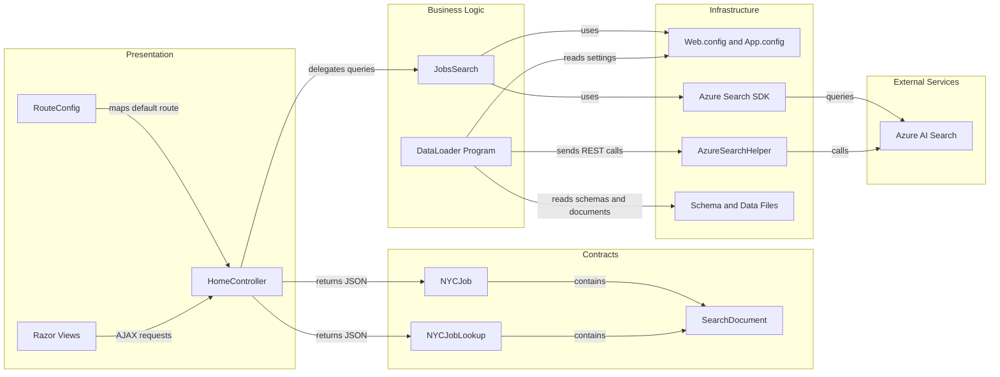

# Architecture Diagram

The repository contains a legacy ASP.NET MVC web application for searching NYC job postings and a companion console data loader for provisioning Azure AI Search indexes.

## Application Architecture

### Technology Stack Summary

| Layer | Technology | Version | Purpose |
|---|---:|---:|---|
| Presentation | ASP.NET MVC | 5.2.2 | Server-side MVC routing, controllers, and Razor views |
| Runtime | .NET Framework | 4.7.2 | Web application target framework |
| Runtime | .NET Framework | 4.5 | Console data loader target framework |
| Search Integration | Azure.Search.Documents | 11.1.1 | Query Azure AI Search indexes from the web app |
| Search Integration | Azure Search REST API | 2015-02-28-Preview | Data loader index creation and document upload |
| Serialization | Newtonsoft.Json | 10.0.3 / 9.0.1 | JSON serialization in web and loader projects |
| Client UI | Bootstrap, jQuery, Modernizr | 3.4.1, 3.1.1, 2.8.3 | Browser styling and interactivity |

### Data Storage & External Services

The application does not use a relational database or ORM. Persistent searchable data is stored externally in Azure AI Search indexes named `nycjobs` and `zipcodes`; the loader recreates these indexes from schema and JSON seed files under `NYCJobsWeb/Schema_and_Data`.

### Key Architectural Decisions

- The web application uses a simple MVC controller plus helper-service pattern rather than dependency injection.
- Search is delegated to Azure AI Search, so filtering, faceting, suggestions, and document lookup are handled by the external search service.
- The data loader is a separate console utility that provisions the same external indexes used by the web application.

## Component Relationships

### Component Inventory

| Component | Layer | Type | Responsibility |
|---|---|---|---|
| `HomeController` | Presentation | MVC Controller | Serves home and details views; exposes search, suggest, and lookup JSON actions |
| `RouteConfig` | Presentation | MVC Route Configuration | Registers the default `{controller}/{action}/{id}` route |
| Razor views and static assets | Presentation | Views and client assets | Render the search UI and invoke controller actions |
| `JobsSearch` | Business Logic | Search service helper | Builds Azure AI Search options, filters, facets, sorting, suggestions, and document lookups |
| `NYCJob` | Contracts | Response model | Wraps search results, facets, and total count for JSON responses |
| `NYCJobLookup` | Contracts | Response model | Wraps a single Azure Search document for details lookup |
| `DataLoader.Program` | Business Logic | Console orchestrator | Deletes, creates, and populates Azure Search indexes from local JSON files |
| `AzureSearchHelper` | Infrastructure | REST helper | Adds API version query parameters and sends Azure Search REST requests |
| `Web.config` / `App.config` | Infrastructure | Configuration | Stores service names and API-key references for web and loader projects |
