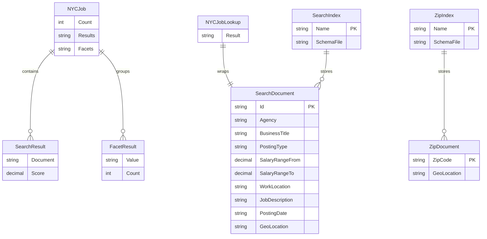

# Data Architecture & Persistence Layer

The application has no relational persistence layer; its searchable data model is stored in two Azure AI Search indexes populated from local schema and JSON files.

## Database Configuration

| Service/Module | DB Type | Profile | Driver | Connection | Migration Tool |
|---|---|---|---|---|---|
| NYCJobsWeb | Azure AI Search | Debug/Release | Azure.Search.Documents SDK | Search endpoint and API key from `Web.config` appSettings | None; index schema managed outside ORM |
| DataLoader | Azure AI Search | Debug/Release | `HttpClient` using Azure Search REST API | Target search service name and API key from `App.config` appSettings | None; recreates indexes from schema files and imports JSON data |

## Data Ownership per Service

| Service | Tables Owned | ORM Framework | Caching | Notes |
|---|---|---|---|---|
| NYCJobsWeb | Reads `nycjobs` and `zipcodes` search indexes | None | None | Query-only web layer; Azure AI Search is the source of searchable data |
| DataLoader | Recreates and writes `nycjobs` and `zipcodes` search indexes | None | None | Operational owner of initial index schema and seed data loading |

## Entity Model

## Key Repository Methods

| Service | Repository | Notable Methods | Purpose |
|---|---|---|---|
| NYCJobsWeb | `JobsSearch` | `Search(...)` | Builds Azure Search query options for text, facets, salary, sort, and distance filters |
| NYCJobsWeb | `JobsSearch` | `SearchZip(zipCode)` | Looks up a zip-code document to derive distance-filter coordinates |
| NYCJobsWeb | `JobsSearch` | `Suggest(term, fuzzy)` | Calls the Azure Search suggester named `sg` and returns suggestion results |
| NYCJobsWeb | `JobsSearch` | `LookUp(id)` | Retrieves a single job document by key |
| DataLoader | `Program` / `AzureSearchHelper` | `DeleteIndex`, `CreateTargetIndex`, `ImportFromJSON` | Recreates each target index and uploads JSON document batches |

## Caching Strategy

No application cache provider, in-memory cache, distributed cache, query result cache, or second-level ORM cache was detected. Search performance is delegated to Azure AI Search indexing and query execution.

## Data Ownership Boundaries

The repository uses an external shared search service rather than database-per-service storage. `DataLoader` owns schema creation and bulk document imports for both indexes; `NYCJobsWeb` reads those indexes through the Azure Search SDK. There is no direct cross-service database access or CQRS implementation; the main read composition happens inside `HomeController.Search`, which optionally joins zip-code coordinates from the `zipcodes` index with job search filters for the `nycjobs` index.

### Data Classification & Sensitivity

| Entity | Sensitive Fields | Classification (PII/PHI/PCI/None) | Controls in Place |
|---|---|---|---|
| SearchDocument | Job posting fields such as agency, title, work location, salary range, and description | Public employment data / potential location data; no PHI or PCI detected | Azure Search API key protects service access; no field-level masking or encryption settings are configured in the application |
| ZipDocument | Zip code and geo location | Location reference data; no PII, PHI, or PCI detected | Azure Search API key protects service access |
| Configuration | Search service API keys | Secret configuration | Values are stored in config placeholders in the repository; no Key Vault or secret store integration detected |
