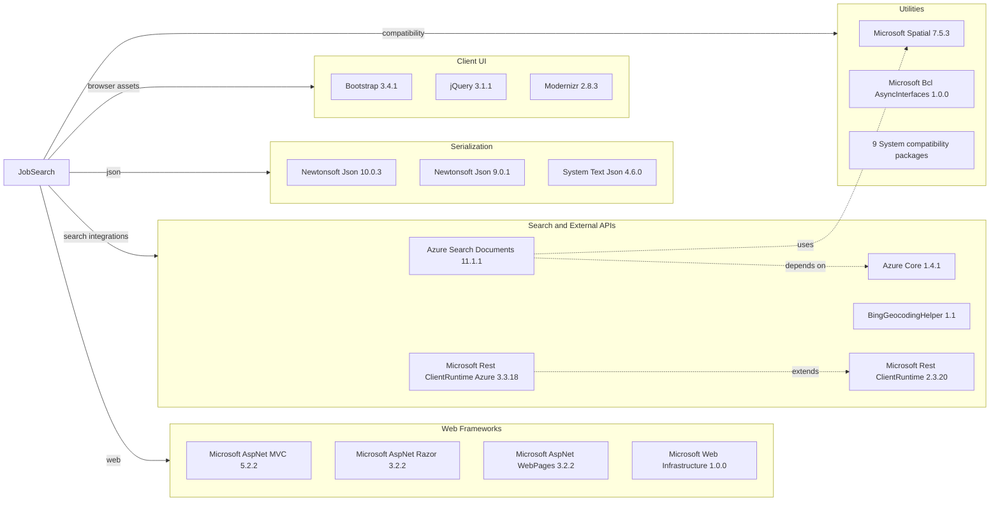

# Dependency Map

JobSearch declares 28 NuGet package dependencies across the ASP.NET MVC web application and console data loader, with no dedicated test dependencies detected.

## Dependencies

### Dependency Summary

| Category | Count | Key Libraries | Notes |
|---|---:|---|---|
| Web Frameworks | 4 | Microsoft.AspNet.Mvc 5.2.2, Razor 3.2.2, WebPages 3.2.2 | Legacy ASP.NET MVC stack on .NET Framework |
| Search and External APIs | 5 | Azure.Search.Documents 11.1.1, Azure.Core 1.4.1, BingGeocodingHelper 1.1 | Main external integration surface is Azure AI Search; Bing helper package is referenced |
| Serialization | 3 | Newtonsoft.Json 10.0.3, Newtonsoft.Json 9.0.1, System.Text.Json 4.6.0 | Two Newtonsoft versions are declared across projects |
| Client UI | 3 | Bootstrap 3.4.1, jQuery 3.1.1, Modernizr 2.8.3 | Static client packages are managed through NuGet |
| Utilities | 13 | Microsoft.Spatial 7.5.3, Microsoft.Bcl.AsyncInterfaces 1.0.0, System.* compatibility packages | Compatibility packages support newer Azure SDKs on .NET Framework |

### Version & Compatibility Risks

The solution targets .NET Framework 4.7.2 and 4.5, both of which require substantial modernization for a move to modern .NET. ASP.NET MVC 5, packages.config, and the legacy web application project format are key migration concerns; client-side packages such as jQuery 3.1.1 and Bootstrap 3.4.1 are also old.

### Notable Observations

- The web project mixes older ASP.NET MVC packages with newer Azure SDK packages that bring multiple System.* compatibility dependencies.
- The data loader uses the older Azure Search REST API version `2015-02-28-Preview` rather than the current Azure SDK.
- There are no messaging, database ORM, cache, or authentication package dependencies declared.
- Test-scoped dependencies are absent, so no automated test framework is visible in package metadata.

## Test Dependencies

| Framework | Version | Notes |
|---|---:|---|
| None detected | N/A | No test project, packages.config test package, or test framework package was found |

Total test-scope dependencies: 0
No test dependencies detected. Consider adding focused tests during modernization to protect the search and data-loading workflows.
