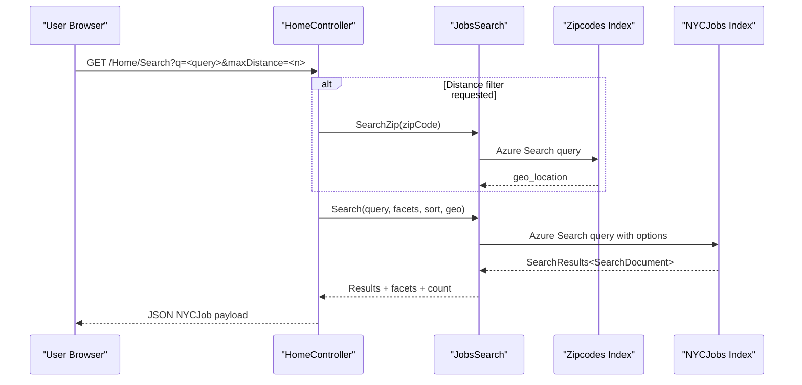

# API & Service Communication Contracts

The API surface is small and concentrated in a single MVC controller that exposes read-oriented JSON endpoints for job search, suggestions, and document lookup. Communication is synchronous and primarily between the web app and Azure AI Search.

## Service Catalog

| Service | Port | Category | Purpose |
|---|---|---|---|
| NYCJobsWeb | 51269 (IIS Express dev setting) | API Layer | Serves UI pages and JSON endpoints for searching job data |
| DataLoader | N/A (console process) | Business | Imports schema/data into Azure AI Search indexes |
| Azure AI Search (external) | 443 | Infrastructure | Hosts `nycjobs` and `zipcodes` indexes queried by the app |

## API Endpoints Inventory

| Service | Method | Path | Request Type | Response Type |
|---|---|---|---|---|
| NYCJobsWeb / HomeController | GET | /Home/Index | None | HTML view |
| NYCJobsWeb / HomeController | GET | /Home/JobDetails | None | HTML view |
| NYCJobsWeb / HomeController | GET | /Home/Search | Query params (`q`, facets, sort, lat/lon, pagination, zipCode, maxDistance) | JSON `NYCJob` |
| NYCJobsWeb / HomeController | GET | /Home/Suggest | Query params (`term`, `fuzzy`) | JSON string array |
| NYCJobsWeb / HomeController | GET | /Home/LookUp | Query param (`id`) | JSON `NYCJobLookup` |

## Management & Observability Endpoints

| Service | Endpoint | Custom Metrics (if any) |
|---|---|---|
| NYCJobsWeb | None explicitly configured | None detected |
| DataLoader | None | None detected |

## DTOs & Contracts

Contract DTOs are minimal and service-level: `NYCJob` wraps result list, facets, and total count; `NYCJobLookup` wraps a single `SearchDocument` payload. Request contracts are query-string based (no body DTOs). No OpenAPI/Swagger specs, protobuf schemas, or GraphQL schemas were found. Serialization is handled by ASP.NET MVC JSON result handling and Azure SDK `SearchDocument` types.

## Communication Patterns

Synchronous HTTP is used throughout. `HomeController` calls `JobsSearch`, which uses Azure SDK clients to issue search, suggest, and lookup requests to Azure AI Search. The DataLoader utility uses direct REST calls through `AzureSearchHelper` to recreate indexes and upload JSON batches. No asynchronous messaging, queue integration, retry/circuit-breaker library, or service discovery mechanism was detected. Startup order only affects data availability: DataLoader should populate indexes before users query the web app. Security posture is API-key based for outbound Azure Search calls; no API-level authentication/authorization controls are evident on web endpoints and TLS termination is expected at hosting layer.

## Service Technology Matrix

| Service | Web | Data Access | Discovery | Gateway | Actuator | Cache | Metrics |
|---|---|---|---|---|---|---|---|
| NYCJobsWeb | ASP.NET MVC 5 | Azure.Search.Documents SDK | None | None | None | None | None |
| DataLoader | None (console) | HttpClient + Azure Search REST | None | None | None | None | None |

## Service Communication Sequence

