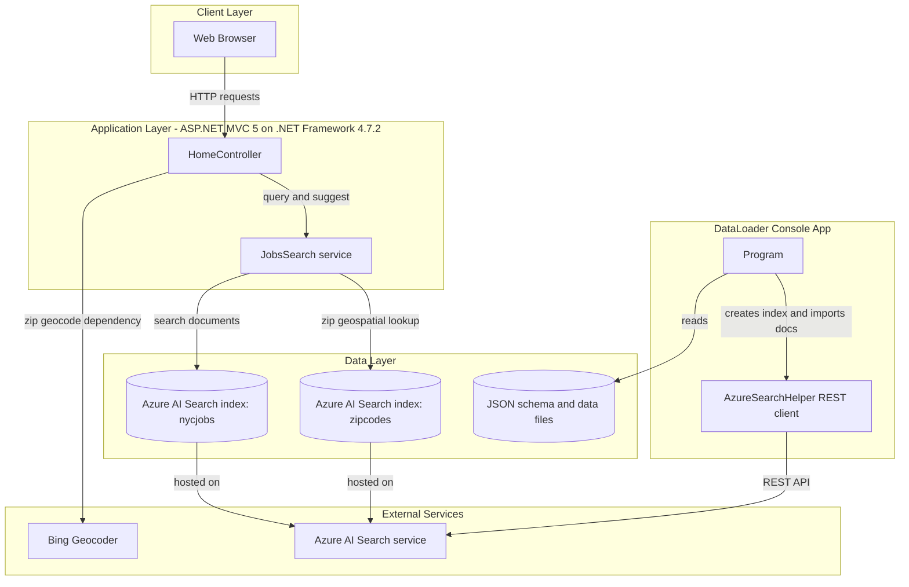
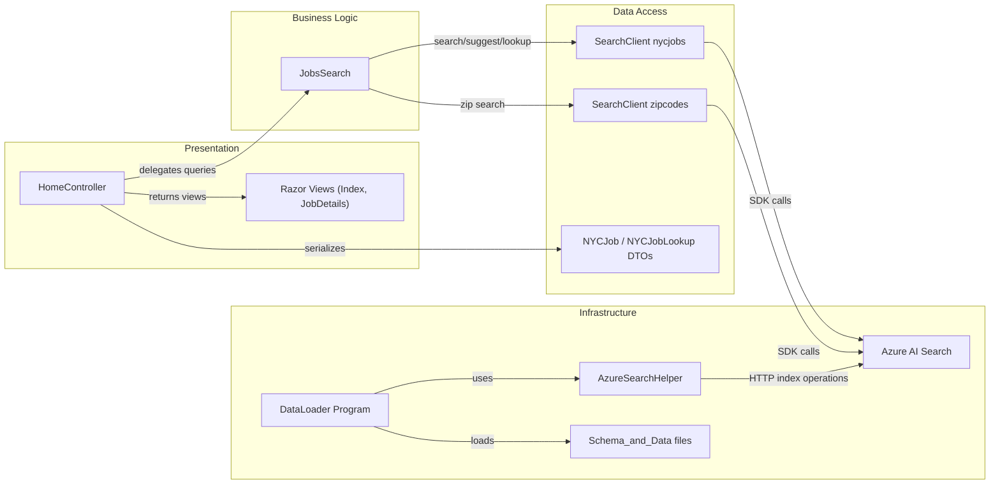

# Architecture Diagram

This repository contains an ASP.NET MVC web application and a companion console loader used to publish schema and sample data into Azure AI Search. The architecture is centered around read-only search experiences backed by two Azure Search indexes.

## Application Architecture

### Technology Stack Summary

| Layer | Technology | Version | Purpose |
|---|---|---|---|
| Presentation | ASP.NET MVC | 5.2.2 | Serves UI and JSON endpoints for job search flows |
| Business / Query | Custom `JobsSearch` wrapper | N/A | Builds search, suggest, lookup, facet, and geo filter options |
| Data Access | Azure.Search.Documents SDK | 11.1.1 | Executes document search and lookup against Azure AI Search |
| Data Store | Azure AI Search | Service-managed | Stores `nycjobs` and `zipcodes` indexes |
| Supporting Tool | .NET console app (`DataLoader`) | .NET Framework 4.5 | Recreates indexes and uploads seed data |

### Data Storage & External Services

The application does not use a relational database; persistent queryable data is held in Azure AI Search indexes (`nycjobs`, `zipcodes`). External dependencies include Azure AI Search for search operations and Bing geocoding support used by the web experience when distance filtering is requested.

### Key Architectural Decisions

- Uses a thin-controller pattern where `HomeController` delegates all search behavior to a dedicated `JobsSearch` service class.
- Treats Azure AI Search as the primary system of record for application reads, with schema and seed data managed separately by `DataLoader`.
- Keeps ingestion concerns out of the web app by isolating index lifecycle operations into a standalone console utility.

## Component Relationships

### Component Inventory

| Component | Layer | Type | Responsibility |
|---|---|---|---|
| HomeController | Presentation | MVC Controller | Handles index page, search, suggest, and lookup actions |
| Razor Views | Presentation | View templates | Renders UI for search and job details |
| JobsSearch | Business Logic | Service class | Builds Azure Search request options and executes search APIs |
| NYCJob / NYCJobLookup | Data Access | DTO classes | Shapes API JSON payloads for search and lookup results |
| SearchClient (`nycjobs`) | Data Access | Azure SDK client | Retrieves job documents, suggestions, and single document lookup |
| SearchClient (`zipcodes`) | Data Access | Azure SDK client | Resolves zip code to geolocation for distance filtering |
| DataLoader Program | Infrastructure | Console entry point | Orchestrates index deletion, creation, and bulk data upload |
| AzureSearchHelper | Infrastructure | HTTP helper | Sends authenticated REST requests to Azure Search endpoints |
| Schema_and_Data | Infrastructure | Seed data assets | Stores index schema and JSON batches used for import |
