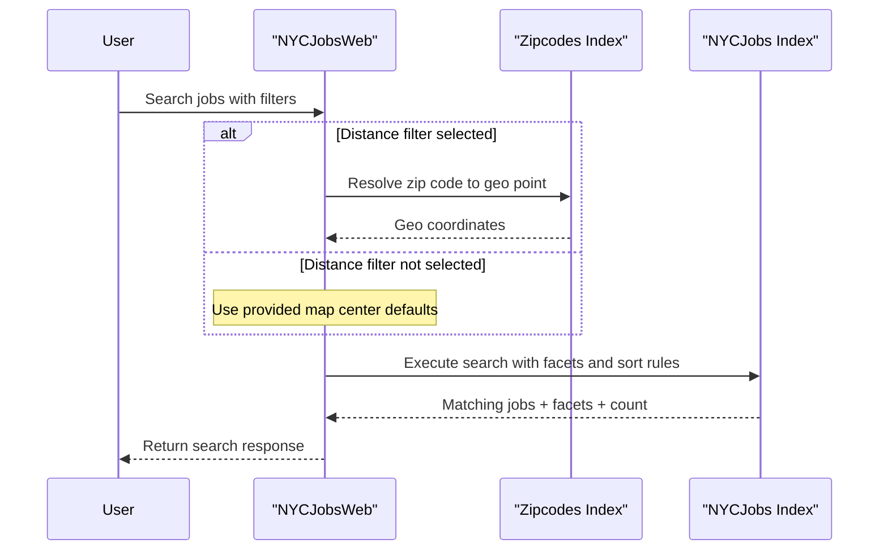

# Core Business Workflows

The application helps users discover and inspect NYC job postings by searching and filtering indexed documents. A secondary operational workflow manages loading and refreshing index data used by the search experience.

## Domain Entities

| Entity | Service / Bounded Context | Description | Key Relationships |
|---|---|---|---|
| Job Posting | NYCJobsWeb / Job Discovery | Searchable representation of an open NYC role | Returned in search result collections and lookup payloads |
| Zip Code Geo Record | NYCJobsWeb / Location Filtering | Geospatial reference for distance-based filtering | Used to resolve geo point before executing distance queries |
| Search Facet Group | NYCJobsWeb / Search Navigation | Buckets for business title, posting type, salary range, etc. | Generated alongside result sets for UI filtering |
| Index Schema Batch | DataLoader / Search Index Maintenance | Schema and JSON import artifacts for search indexes | Drives index creation and document upload workflow |

## Service-to-Domain Mapping

| Service | Domain Context | Owned Entities | External Dependencies |
|---|---|---|---|
| NYCJobsWeb | Job Discovery | Job Posting view models, Search Facet Group wrappers | Azure AI Search `nycjobs` and `zipcodes` indexes |
| DataLoader | Search Index Maintenance | Index schema batch and import workflow state | Azure AI Search REST API |

## Primary Workflows

### Workflow 1: Search job postings with optional distance filtering

1. User submits `/Home/Search` with free-text query and optional facets.
2. If distance filtering is requested, the system resolves zip code coordinates from the zip index.
3. Search options are assembled (facets, ordering, highlighting, filter clauses).
4. Query executes against the jobs index.
5. Results, facets, and count are wrapped in `NYCJob` and returned as JSON.

Business rules involved: blank query is converted to wildcard (`*`), distance filter is only applied when `maxDistance > 0`, and sort behavior follows selected sort mode.

### Workflow 2: Retrieve search suggestions and job detail

1. User types a term and calls `/Home/Suggest`.
2. Suggest endpoint executes fuzzy/non-fuzzy suggest query and deduplicates returned text values.
3. User selects an item and calls `/Home/LookUp?id=<id>`.
4. Lookup returns a single job document wrapped as `NYCJobLookup`.

Business rules involved: suggestion values are distinct before response; lookup only executes when an ID is provided.

### Workflow 3: Refresh Azure Search indexes (operational)

1. Operator runs DataLoader console.
2. Process deletes each target index, recreates schema, then uploads JSON batches.
3. Operation repeats for `zipcodes` and `nycjobs` indexes.

Business rules involved: index recreation occurs before import; failures are logged to console and process continues per step-level handling.

## Cross-Service Data Flows

The primary cross-service flow is web-to-search-service communication. The web app composes user query inputs, optionally enriches with geolocation from zip index data, then queries the jobs index and returns composed result payloads. Degraded behavior occurs when search service calls fail: controller/service catches exceptions and returns null or partial behavior rather than retry/circuit-breaker fallback.

## Business Workflow Sequence

## Business Rules & Decision Logic

- Empty or whitespace search text is normalized to wildcard search for broader discovery.
- Sorting decisions map to explicit modes (`featured`, `salaryDesc`, `salaryIncr`, `mostRecent`).
- Distance filtering requires successful zip lookup before geo-distance predicate is added.
- Suggest results are deduplicated before response to reduce noisy UX.
- Operational index refresh follows a strict sequence: delete index, create schema, upload documents.
