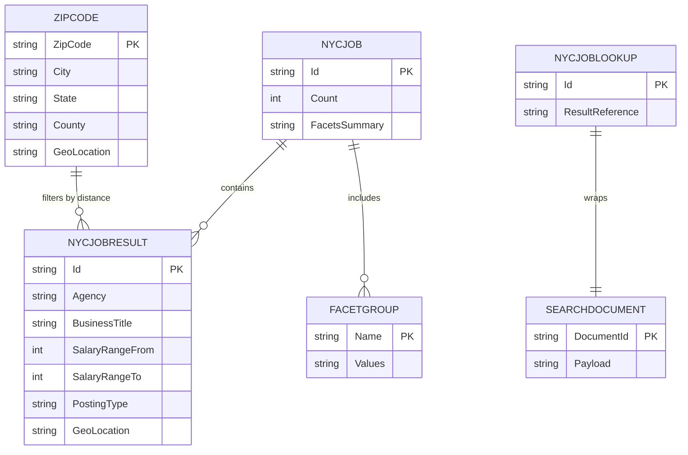

# Data Architecture & Persistence Layer

The data layer is search-index centric: the application reads from Azure AI Search indexes rather than a relational database. Persistence behavior is split between read APIs in the web app and index lifecycle/data import operations in a console utility.

## Database Configuration

| Service/Module | DB Type | Profile | Driver | Connection | Migration Tool |
|---|---|---|---|---|---|
| NYCJobsWeb | Azure AI Search (document index) | Default (`Web.config`) | Azure.Search.Documents SDK | Endpoint + API key from app settings | None detected |
| DataLoader | Azure AI Search (document index) | Default (`App.config`) | HttpClient + REST API | Service URI built from `TargetSearchServiceName` and API key header | Schema/data JSON files applied by loader |

## Data Ownership per Service

| Service | Tables Owned | ORM Framework | Caching | Notes |
|---|---|---|---|---|
| NYCJobsWeb | `nycjobs` index documents (read access), `zipcodes` index documents (read access) | None (SDK document model) | None | Reads and filters indexed documents only |
| DataLoader | `nycjobs` and `zipcodes` index schema/data publication | None (REST calls) | None | Recreates index definitions and bulk uploads JSON files |

## Entity Model

## Key Repository Methods

| Service | Repository | Notable Methods | Purpose |
|---|---|---|---|
| NYCJobsWeb | `JobsSearch` (`JobsSearch.cs`) | `Search(...)`, `SearchZip(...)`, `Suggest(...)`, `LookUp(...)` | Encapsulates all query and lookup behavior against Azure Search indexes |
| DataLoader | `Program` + `AzureSearchHelper` | `LaunchImportProcess(...)`, `DeleteIndex(...)`, `CreateTargetIndex(...)`, `ImportFromJSON(...)`, `SendSearchRequest(...)` | Manages index lifecycle and uploads seed data batches |

## Caching Strategy

No explicit application cache provider or cache-aside/write-through pattern was found. Query responses are fetched directly from Azure AI Search on each request, with any caching behavior delegated to Azure service internals or infrastructure layers outside this codebase.

## Data Ownership Boundaries

Data storage is centralized in shared Azure AI Search service indexes. The web app is read/query focused and never mutates domain documents directly, while DataLoader is the ingestion and schema-management authority. Cross-component data access occurs through service APIs (Azure SDK in web app, REST in DataLoader) rather than shared in-memory models.

### Data Classification & Sensitivity

| Entity | Sensitive Fields | Classification (PII/PHI/PCI/None) | Controls in Place |
|---|---|---|---|
| NYCJOBRESULT | `work_location`, `recruitment_contact` (if present in indexed docs) | PII (possible contact/location data) | API-key access to search service; no explicit field masking or encryption controls in code |
| ZIPCODE | Geographic location fields | None | Public geographic reference data |
| NYCJOB / NYCJOBLOOKUP wrappers | None directly (container objects) | None | N/A |
