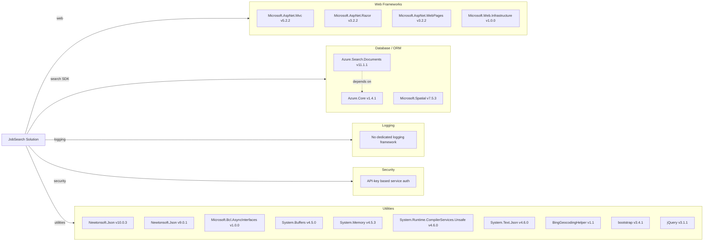

# Dependency Map

This repository declares about 28 primary external dependencies across two .NET Framework projects, focused on ASP.NET MVC presentation and Azure Search integration.

## Dependencies

### Dependency Summary

| Category | Count | Key Libraries | Notes |
|---|---:|---|---|
| Web Frameworks | 4 | Microsoft.AspNet.Mvc, Razor, WebPages | Legacy ASP.NET MVC stack on .NET Framework |
| Database / ORM | 3 | Azure.Search.Documents, Azure.Core, Microsoft.Spatial | Search-index data access instead of relational ORM |
| Logging | 0 | N/A | Uses console/error output only |
| Security | 1 | API key auth pattern | API keys stored in config values |
| Utilities | 20+ | Newtonsoft.Json, System.* backports, jQuery, Bootstrap | Mix of framework support packages and frontend libraries |

### Version & Compatibility Risks

The codebase targets .NET Framework 4.7.2 and 4.5-era dependencies; several packages (ASP.NET MVC 5.x, older System.* compatibility packages, Newtonsoft 9/10 split) indicate modernization pressure for current .NET runtimes. Azure.Search.Documents 11.1.1 is relatively old and may require API updates when moving to net10.

### Notable Observations

- Two different Newtonsoft.Json major versions are used across projects (`9.0.1` in DataLoader, `10.0.3` in web app).
- Front-end dependencies are older (`bootstrap 3.4.1`, `jQuery 3.1.1`) and may require compatibility review for modernization.
- No explicit resilience, telemetry, or structured logging dependency is declared.
- Search behavior relies heavily on Azure SDK and service-side scoring profiles, reducing local persistence complexity.

## Test Dependencies

| Framework | Version | Notes |
|---|---|---|
| None detected | N/A | No test framework packages found in `packages.config` or project references |

Total test-scope dependencies: 0
No test dependencies detected.
